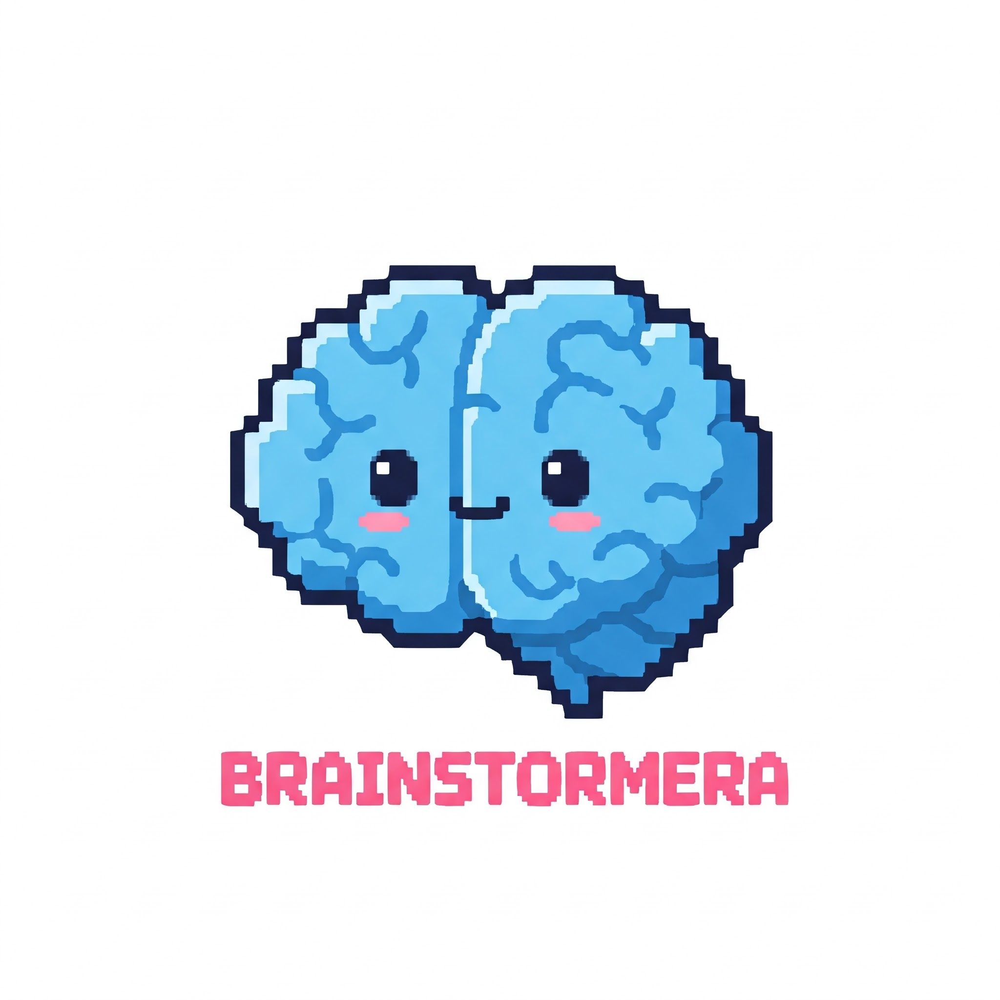

# BrainStormEra - Advanced E-Learning Platform 🧠

<div align="center">
  
  
  <p align="center">
    <strong>A Comprehensive Web-Based Educational Platform with Interactive Learning Experience</strong>
  </p>
  
  <p align="center">
    
    
    
    
    
    
  </p>
  
  <p align="center">
    
    
    
  </p>
</div>

## 📋 Project Overview

**BrainStormEra** is a sophisticated web-based educational platform developed using modern .NET technologies, designed to deliver comprehensive learning experiences for students, instructors, and administrators. The system implements a robust multi-layered architecture pattern, incorporating ASP.NET Core MVC, Razor Pages, Entity Framework Core, and SQL Server to provide scalable and maintainable e-learning solutions.

### 🎯 Project Objectives

- **Educational Excellence**: Develop a modern, user-centric online learning platform that enhances educational accessibility and engagement
- **Scalable Architecture**: Implement enterprise-level software architecture patterns ensuring maintainability, testability, and scalability
- **Interactive Learning**: Provide dynamic course management, interactive lessons, and real-time assessment capabilities
- **AI Integration**: Incorporate intelligent chatbot assistance for 24/7 student support and personalized learning recommendations
- **Achievement System**: Design comprehensive progress tracking, certification management, and gamification elements
- **Real-time Communication**: Enable live notifications and interactive features using SignalR technology

### 🏗️ Academic Context

This project serves as a comprehensive demonstration of modern web application development principles, showcasing:

- **Software Engineering Best Practices**: Clean code architecture, SOLID principles, and design patterns
- **Full-Stack Development**: Integration of frontend and backend technologies in a cohesive system
- **Database Design**: Normalized relational database schema with Entity Framework Code-First approach
- **API Development**: RESTful services and real-time communication protocols
- **DevOps Practices**: Containerization, automated deployment, and continuous integration workflows

## ✨ Core Features & Functionality

### 🎓 **Learning Management System (LMS)**

- **Advanced Course Management**: CRUD operations for courses with metadata, prerequisites, and scheduling
- **Interactive Content Delivery**: Multi-media lesson content supporting video, audio, documents, and interactive elements
- **Structured Learning Paths**: Hierarchical chapter-lesson organization with dependency management
- **Assessment Engine**: Comprehensive quiz system with multiple question types, auto-grading, and detailed analytics
- **Progress Tracking**: Real-time learning analytics with completion rates and performance metrics

### 👥 **User Management & Authentication**

- **Secure Authentication**: JWT-based authentication with role-based authorization (RBAC)
- **Multi-Role Architecture**: Distinct user roles (Administrator, Instructor, Student) with granular permissions
- **Profile Management**: Comprehensive user profiles with learning history and preferences
- **Real-time Notifications**: SignalR-powered instant messaging and system notifications
- **Session Management**: Secure session handling with automatic timeout and refresh mechanisms

### 🤖 **AI-Powered Virtual Assistant**

- **Intelligent Learning Support**: 24/7 chatbot assistance with natural language processing
- **Personalized Recommendations**: AI-driven course suggestions based on learning patterns
- **Interactive Guidance**: Context-aware help system for platform navigation
- **Learning Analytics**: AI analysis of user behavior for performance optimization

### 🏆 **Achievement & Certification System**

- **Gamification Elements**: Badge system for learning milestones and engagement
- **Digital Certificates**: Automated certificate generation upon course completion
- **Progress Dashboard**: Comprehensive analytics dashboard with visual progress indicators
- **Performance Analytics**: Detailed reporting on learning outcomes and skill development

### 📊 **Administrative Features**

- **Content Management**: Advanced CMS for course materials and platform content
- **User Analytics**: Comprehensive reporting on user engagement and platform usage
- **System Configuration**: Flexible platform settings and customization options
- **Data Export**: Reporting capabilities with multiple export formats (PDF, Excel, CSV)

## 🛠️ Technology Stack & Architecture

### **Backend Technologies**

- **ASP.NET Core 6.0**: Cross-platform web framework with high-performance HTTP pipeline
- **C# 10.0**: Primary programming language with modern language features
- **Entity Framework Core 6.0**: Object-Relational Mapping (ORM) with Code-First migrations
- **SignalR**: Real-time web functionality enabling bi-directional communication
- **AutoMapper**: Object-to-object mapping for clean data transformation
- **FluentValidation**: Business rule validation with fluent interface
- **Serilog**: Structured logging with multiple sinks and enrichers

### **Frontend Technologies**

- **Razor Pages & MVC Views**: Server-side rendering with strongly-typed models
- **HTML5/CSS3**: Modern web standards with semantic markup
- **JavaScript ES6+**: Modern JavaScript with async/await patterns
- **jQuery 3.6**: DOM manipulation and AJAX communication
- **Bootstrap 5**: Mobile-first responsive CSS framework
- **Chart.js**: Interactive data visualization and analytics charts
- **TinyMCE**: Rich text editor for content creation

### **Database & Data Access**

- **Microsoft SQL Server 2019**: Enterprise-grade relational database
- **Entity Framework Core**: Code-First approach with automatic migrations
- **LINQ**: Language-Integrated Query for type-safe data access
- **SQL Server Express LocalDB**: Development database instance

### **Security & Authentication**

- **ASP.NET Core Identity**: Comprehensive authentication and authorization system
- **JWT Tokens**: Stateless authentication for API endpoints
- **Role-Based Access Control (RBAC)**: Granular permission system
- **Data Protection API**: Secure data encryption and key management
- **HTTPS/TLS**: Encrypted communication protocols

### **DevOps & Deployment**

- **Docker & Docker Compose**: Containerized application deployment
- **GitHub Actions**: Continuous Integration/Continuous Deployment (CI/CD)
- **Azure DevOps**: Project management and release pipelines
- **IIS**: Internet Information Services for production deployment

### **Architecture Patterns & Principles**

- **Clean Architecture**: Dependency rule with domain-centric design
- **Repository Pattern**: Data access abstraction with unit of work
- **Dependency Injection**: IoC container for loose coupling
- **CQRS Pattern**: Command Query Responsibility Segregation for complex operations
- **Builder Pattern**: Complex object construction with fluent interface
- **Factory Pattern**: Object creation with abstraction layer

## 📁 Project Architecture & Structure

### **System Architecture Overview**

```
┌─────────────────────────────────────────────────────────────┐
│                    Presentation Layer                       │
├─────────────────────┬───────────────────────────────────────┤
│   MVC Application   │         Razor Pages App               │
│   (Port 5216)       │         (Port 5274)                   │
└─────────────────────┴───────────────────────────────────────┘
                              │
┌─────────────────────────────────────────────────────────────┐
│                 Business Logic Layer                        │
├─────────────────────────────────────────────────────────────┤
│  Services │ Validators │ Managers │ Processors │ Handlers   │
└─────────────────────────────────────────────────────────────┘
                              │
┌─────────────────────────────────────────────────────────────┐
│                 Data Access Layer                           │
├─────────────────────────────────────────────────────────────┤
│  Repositories │ DbContext │ Entities │ Migrations │ UoW     │
└─────────────────────────────────────────────────────────────┘
                              │
┌─────────────────────────────────────────────────────────────┐
│                 Database Layer                              │
├─────────────────────────────────────────────────────────────┤
│              SQL Server 2019 (Port 1433)                    │
└─────────────────────────────────────────────────────────────┘
```

### **Directory Structure**

```
BrainStormEra/
├── 📂 BrainStormEra-MVC/              # Primary MVC Web Application
│   ├── 📂 Controllers/                # MVC Controllers with action methods
│   │   ├── 🎯 HomeController.cs       # Landing page and navigation
│   │   ├── 🔐 AuthController.cs       # Authentication & authorization
│   │   ├── 📚 CourseController.cs     # Course management operations
│   │   ├── 📖 LessonController.cs     # Lesson content delivery
│   │   ├── ❓ QuizController.cs       # Assessment and evaluation
│   │   ├── 👤 ProfileController.cs    # User profile management
│   │   ├── 🤖 ChatbotController.cs    # AI assistant integration
│   ├── 📂 Models/                     # ViewModels and DTOs
│   ├── 📂 Views/                      # Razor view templates
│   ├── 📂 Filters/                    # Action and authorization filters
│   └── 📂 wwwroot/                    # Static assets (CSS, JS, images)
├── 📂 BrainStormEra-Razor/            # Alternative Razor Pages Implementation
├── 📂 BusinessLogicLayer/             # Domain Logic and Business Rules
│   ├── 📂 Services/                   # Business service implementations
│   ├── 📂 Interfaces/                 # Service contracts and abstractions
│   ├── 📂 Validators/                 # Business rule validation
│   └── 📂 DTOs/                       # Data Transfer Objects
├── 📂 DataAccessLayer/                # Data Persistence Layer
│   ├── 📂 Entities/                   # Entity Framework models
│   ├── 📂 DbContexts/                 # Database context configurations
│   ├── 📂 Repositories/               # Data access repositories
│   ├── 📂 Migrations/                 # Database schema migrations
│   └── 📂 Configurations/             # Entity configurations
├── 📂 init_script/                    # Database initialization scripts
├── 📂 .github/workflows/              # CI/CD automation workflows
├── 📄 docker-compose.yml             # Multi-container orchestration
├── 📄 BrainStormEra.sln              # Visual Studio solution file
└── 📄 README.md                      # Project documentation
```

## 🚀 Installation & Setup Guide

### **System Requirements**

- **Operating System**: Windows 10/11, macOS 10.15+, or Linux Ubuntu 18.04+
- **Docker Desktop**: Latest stable version (4.0+)
- **.NET 6.0 SDK**: Long-term support version
- **SQL Server**: 2019 or later (Express/Developer/Standard editions)
- **IDE**: Visual Studio 2022, JetBrains Rider, or Visual Studio Code
- **Memory**: Minimum 8GB RAM (16GB recommended for optimal performance)
- **Storage**: At least 5GB free disk space

### **Development Environment Setup**

#### **1. Repository Clone & Initial Setup**

```bash
# Clone the repository
git clone https://github.com/LTPPPP/BrainStormEra-v2.git
cd BrainStormEra

# Verify .NET SDK installation
dotnet --version

# Restore NuGet packages for all projects
dotnet restore BrainStormEra.sln
```

#### **2. Docker-based Deployment (Recommended)**

```bash
# Build and start all services in development mode
docker-compose up --build

# Run in detached mode (background)
docker-compose up -d --build

# View logs for specific service
docker-compose logs -f mvc

# Stop all services
docker-compose down

# Remove volumes (reset database)
docker-compose down -v
```

#### **3. Local Development Setup (Without Docker)**

```bash
# Install Entity Framework CLI tools
dotnet tool install --global dotnet-ef

# Navigate to DataAccessLayer
cd DataAccessLayer

# Create initial migration (if not exists)
dotnet ef migrations add InitialCreate

# Update database schema
dotnet ef database update

# Return to solution root
cd ..

# Start MVC application
cd BrainStormEra-MVC
dotnet run --urls="https://localhost:5001;http://localhost:5000"

# In a new terminal, start Razor application
cd BrainStormEra-Razor
dotnet run --urls="https://localhost:5003;http://localhost:5002"
```

### **Application Access Points**

- **🌐 MVC Application**: [https://localhost:5216](https://localhost:5216) (HTTPS) | [http://localhost:5000](http://localhost:5000) (HTTP)
- **🌐 Razor Application**: [https://localhost:5274](https://localhost:5274) (HTTPS) | [http://localhost:5002](http://localhost:5002) (HTTP)
- **🗄️ SQL Server**: `localhost:1433` (Docker) | `(localdb)\MSSQLLocalDB` (Local)
- **📊 Database Management**: Use SQL Server Management Studio (SSMS) or Azure Data Studio

### **Database Configuration**

```json
{
  "ConnectionStrings": {
    "DefaultConnection": "Server=localhost;Database=BrainStormEra;User Id=sa;Password=YourStrong!Password;TrustServerCertificate=true;",
    "LocalConnection": "Server=(localdb)\\MSSQLLocalDB;Database=BrainStormEra;Trusted_Connection=true;TrustServerCertificate=true;"
  }
}
```

## ⚙️ Configuration & Environment Setup

### **Environment Variables**

```env
# Application Environment
ASPNETCORE_ENVIRONMENT=Development
ASPNETCORE_URLS=https://localhost:5001;http://localhost:5000

# Database Configuration
SA_PASSWORD=YourStrong!Password
ACCEPT_EULA=Y
DATABASE_CONNECTION_STRING=Server=localhost,1433;Database=BrainStormEra;User Id=sa;Password=YourStrong!Password;TrustServerCertificate=true;

# Security Settings
JWT_SECRET_KEY=your-super-secure-secret-key-here-with-at-least-32-characters
JWT_EXPIRE_HOURS=24
ENCRYPTION_KEY=your-encryption-key-for-sensitive-data

# External Services
SMTP_HOST=smtp.gmail.com
SMTP_PORT=587
SMTP_USERNAME=your-email@gmail.com
SMTP_PASSWORD=your-app-password
```

### **Configuration Files Structure**

```json
// appsettings.json
{
  "ConnectionStrings": {
    "DefaultConnection": "Server=localhost,1433;Database=BrainStormEra;User Id=sa;Password=YourStrong!Password;TrustServerCertificate=true;",
    "LocalConnection": "Server=(localdb)\\MSSQLLocalDB;Database=BrainStormEra;Trusted_Connection=true;"
  },
  "JwtSettings": {
    "SecretKey": "your-secret-key",
    "Issuer": "BrainStormEra",
    "Audience": "BrainStormEra-Users",
    "ExpiryInHours": 24
  },
  "Logging": {
    "LogLevel": {
      "Default": "Information",
      "Microsoft.AspNetCore": "Warning",
      "Microsoft.EntityFrameworkCore": "Information"
    }
  }
}
```

## 👥 User Guide & Workflow Documentation

### **🎓 Student Workflow**

1. **Account Registration**:
   - Complete profile setup with academic information
   - Email verification and account activation
   - Initial skills assessment and learning preferences
2. **Course Discovery**:
   - Browse categorized course catalog with filtering options
   - View course previews, syllabi, and instructor profiles
   - Read reviews and ratings from other students
3. **Enrollment Process**:
   - Select desired courses and add to learning path
   - Configure learning schedule and notification preferences
   - Access course materials and supplementary resources
4. **Learning Experience**:
   - Progress through structured lessons and chapters
   - Participate in interactive content and multimedia lessons
   - Track learning analytics and performance metrics
5. **Assessment & Evaluation**:
   - Complete chapter quizzes and comprehensive exams
   - Receive immediate feedback and detailed explanations
   - Retake assessments to improve understanding
6. **Certification & Achievement**:
   - Earn digital badges for completed milestones
   - Generate completion certificates with verification codes
   - Build comprehensive learning portfolio

### **🧑‍🏫 Instructor Workflow**

1. **Professional Onboarding**:
   - Submit credentials and teaching experience verification
   - Complete instructor training and platform orientation
   - Set up instructor profile and teaching preferences
2. **Course Development**:
   - Create comprehensive course outlines and learning objectives
   - Develop multimedia content using integrated authoring tools
   - Organize content into logical chapters and learning modules
3. **Content Management**:
   - Upload and organize diverse learning materials (videos, documents, presentations)
   - Create interactive elements and knowledge check points
   - Configure course prerequisites and learning paths
4. **Assessment Creation**:
   - Design varied assessment types (multiple choice, essay, practical)
   - Set up automated grading rules and rubrics
   - Create personalized feedback templates
5. **Student Interaction**:
   - Monitor student progress through analytics dashboard
   - Provide personalized feedback and guidance
   - Conduct virtual office hours and Q&A sessions
6. **Performance Analysis**:
   - Analyze course effectiveness through detailed metrics
   - Generate reports on student outcomes and engagement
   - Continuously improve content based on feedback

### **🔧 Administrator Workflow**

1. **System Administration**:
   - Manage user accounts, roles, and permissions
   - Configure system-wide settings and policies
   - Monitor platform performance and resource utilization
2. **Content Governance**:
   - Review and approve course content before publication
   - Ensure quality standards and educational guidelines compliance
   - Manage content libraries and shared resources
3. **Analytics & Reporting**:
   - Generate comprehensive platform usage reports
   - Analyze user engagement and learning outcomes
   - Monitor financial metrics and enrollment trends
4. **Technical Maintenance**:
   - Perform regular system backups and data integrity checks
   - Manage database optimization and performance tuning
   - Coordinate with development team for updates and enhancements
5. **Support & Communication**:
   - Handle escalated user support requests
   - Communicate platform updates and announcements
   - Manage stakeholder relationships and feedback integration

## 🔧 Development Guide & Best Practices

### **Database Management**

```bash
# Entity Framework Commands
dotnet ef migrations add MigrationName --project DataAccessLayer --startup-project BrainStormEra-MVC
dotnet ef database update --project DataAccessLayer --startup-project BrainStormEra-MVC
dotnet ef migrations remove --project DataAccessLayer --startup-project BrainStormEra-MVC

# Database Seeding
dotnet run --project BrainStormEra-MVC --seed-data

# Generate SQL Scripts
dotnet ef migrations script --project DataAccessLayer --startup-project BrainStormEra-MVC
```

### **Build & Testing Commands**

```bash
# Clean and rebuild solution
dotnet clean BrainStormEra.sln
dotnet build BrainStormEra.sln --configuration Release

# Run unit tests with coverage
dotnet test --collect:"XPlat Code Coverage" --results-directory TestResults/

# Package for deployment
dotnet publish BrainStormEra-MVC -c Release -o ./publish
```

### **Code Quality & Analysis**

```bash
# Code formatting
dotnet format BrainStormEra.sln

# Security analysis
dotnet list package --vulnerable
dotnet list package --outdated

# Performance profiling
dotnet run --project BrainStormEra-MVC --configuration Release --no-build
```

## 🤝 Contributing Guidelines

### **Development Workflow**

1. **Fork Repository**: Create a personal fork of the main repository
2. **Create Feature Branch**: `git checkout -b feature/descriptive-feature-name`
3. **Implement Changes**: Follow coding standards and write comprehensive tests
4. **Commit Guidelines**: Use conventional commits (feat:, fix:, docs:, style:, refactor:, test:, chore:)
5. **Pull Request**: Submit PR with detailed description and reference to issues
6. **Code Review**: Address feedback and ensure CI/CD pipeline passes

### **Coding Standards & Best Practices**

- **C# Conventions**: Follow Microsoft C# Coding Conventions and StyleCop rules
- **Naming Standards**: Use PascalCase for public members, camelCase for private fields
- **Documentation**: XML documentation comments for public APIs
- **Testing**: Minimum 80% code coverage with unit and integration tests
- **Security**: Follow OWASP security guidelines and dependency scanning
- **Performance**: Implement async/await patterns for I/O operations
- **Architecture**: Maintain separation of concerns and SOLID principles

### **Project Requirements**

- All new features must include comprehensive unit tests
- Integration tests for controller actions and business logic
- Database migrations with both up and down methods
- API documentation using Swagger/OpenAPI specifications
- Performance benchmarks for critical path operations

## 📄 License & Legal Information

This project is licensed under the **MIT License** - see the [LICENSE](LICENSE) file for complete details.

### **Third-Party Libraries**

- ASP.NET Core (Apache 2.0)
- Entity Framework Core (Apache 2.0)
- Bootstrap (MIT)
- jQuery (MIT)
- Chart.js (MIT)

### **Academic Use Policy**

This project is developed for educational purposes and academic research. Commercial use requires explicit permission from the development team.

## 📞 Support & Community

### **Development Team**

- **Project Lead**: [GitHub Profile](https://github.com/LTPPPP)
- **Email Support**: brainstormera.pro@gmail.com
- **Repository**: [BrainStormEra-v2](https://github.com/LTPPPP/BrainStormEra-v2)

### **Issue Reporting & Feature Requests**

- **Bug Reports**: Use GitHub Issues with bug report template
- **Feature Requests**: Submit enhancement proposals with detailed specifications
- **Security Issues**: Report privately to brainstormera.security@gmail.com
- **Documentation**: Contribute to wiki and documentation improvements

### **Community Engagement**

- **Discussions**: GitHub Discussions for general questions and ideas
- **Code of Conduct**: Please read and follow our community guidelines
- **Contributing Guide**: Detailed contribution instructions in CONTRIBUTING.md

### **Academic Collaboration**

- **Research Partnerships**: Open to academic collaboration and research projects
- **Student Projects**: Welcome contributions from computer science students
- **Thesis Support**: Available for undergraduate and graduate thesis projects

---

<div align="center">
  <h3>🎓 Academic Project - BrainStormEra E-Learning Platform</h3>
  <p><strong>Demonstrating Modern Web Development Practices & Educational Technology Innovation</strong></p>
  
<p>
   <a href="https://github.com/LTPPPP/BrainStormEra-v2/stargazers">
      
   </a>
   <a href="https://github.com/LTPPPP/BrainStormEra-v2/network/members">
      
   </a>
   <a href="https://github.com/LTPPPP/BrainStormEra-v2/watchers">
      
   </a>
</p>
  <p>🌟 <strong>If this project helps your learning journey, please give us a star!</strong> 🌟</p>
  <p>Built with ❤️ by Computer Science Students | Powered by .NET 6.0 & Modern Web Technologies</p>
</div>
