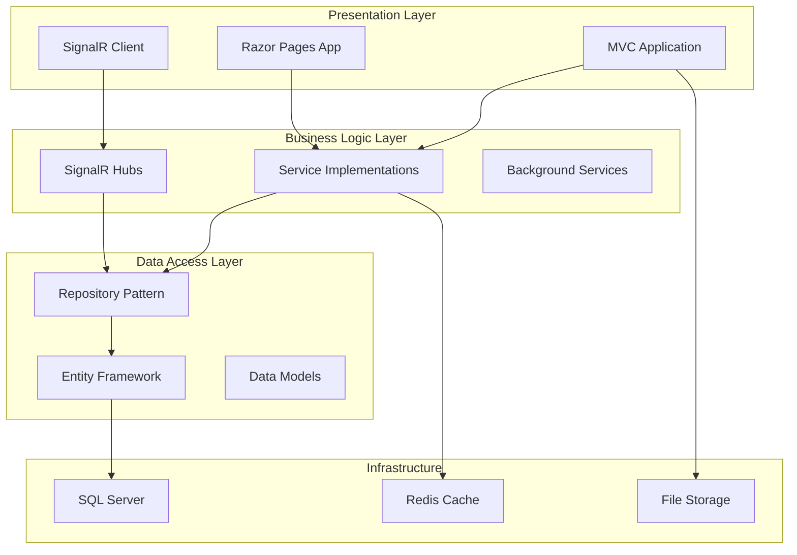
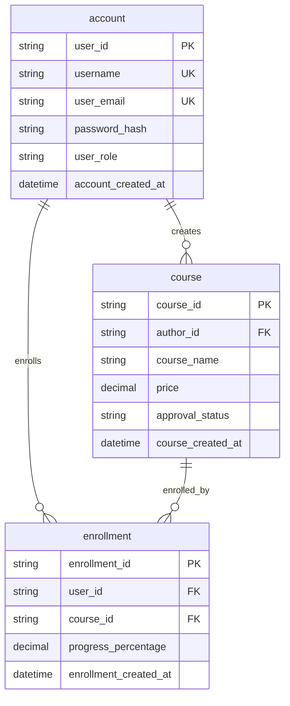
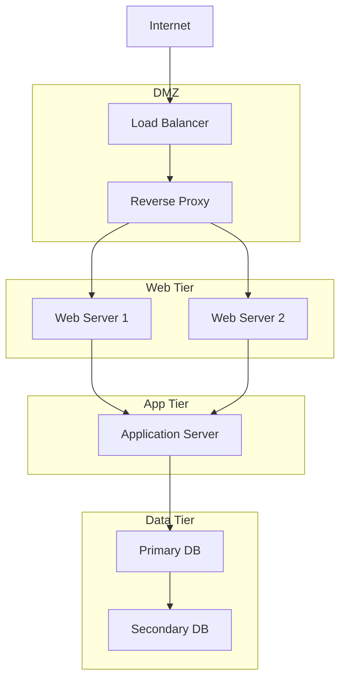

# Software Design Document (SDD)
## BrainStormEra E-Learning Platform

**Document Version:** 1.0  
**Date:** December 2024  
**Status:** Draft  
**Classification:** Internal Use

---

## Document Control

| Version | Date | Author | Description |
|---------|------|--------|-------------|
| 1.0 | Dec 2024 | Development Team | Initial SDD Release |

## Table of Contents

1. [Introduction](#1-introduction)
2. [System Overview](#2-system-overview)
3. [System Architecture](#3-system-architecture)
4. [Detailed Design](#4-detailed-design)
5. [Database Design](#5-database-design)
6. [Deployment Architecture](#6-deployment-architecture)
7. [Interface Design](#7-interface-design)
8. [Appendices](#8-appendices)

---

## 1. Introduction

### 1.1 Purpose
This Software Design Document (SDD) describes the architectural and detailed design of the BrainStormEra E-Learning Platform. This document follows IEEE Standard 1016-2009 for Software Design Descriptions.

### 1.2 Scope
The BrainStormEra platform is a comprehensive web-based educational system supporting:
- Multi-role user management (Guest, Learner, Instructor, Admin)
- Course creation and management
- Assessment and evaluation systems
- Real-time communication
- AI-powered chatbot assistance
- Achievement and certification systems

### 1.3 Definitions and Acronyms

| Term | Definition |
|------|------------|
| API | Application Programming Interface |
| EF | Entity Framework |
| LMS | Learning Management System |
| SDD | Software Design Document |
| UML | Unified Modeling Language |
| RBAC | Role-Based Access Control |

### 1.4 References
- IEEE Std 1016-2009: Standard for Information Technology—Systems Design—Software Design Descriptions
- IEEE Std 830-1998: Recommended Practice for Software Requirements Specifications
- ASP.NET Core Documentation
- Entity Framework Core Documentation

### 1.5 Document Overview
This SDD is organized into eight main sections covering system architecture, detailed design, database design, and deployment specifications.

---

## 2. System Overview

### 2.1 System Context
The BrainStormEra platform operates as a distributed web application serving educational content to multiple user types through a responsive web interface.

### 2.2 System Functions
- **F-001**: User Authentication and Authorization
- **F-002**: Course Content Management
- **F-003**: Learning Progress Tracking
- **F-004**: Assessment and Evaluation
- **F-005**: Real-time Communication
- **F-006**: Achievement Management
- **F-007**: Payment Processing
- **F-008**: AI Chatbot Integration

### 2.3 System Constraints
- **SC-001**: Web-based application using ASP.NET Core 8.0
- **SC-002**: SQL Server 2019+ database requirement
- **SC-003**: Support for 1000+ concurrent users
- **SC-004**: 99.9% uptime availability requirement
- **SC-005**: GDPR compliance for user data

---

## 3. System Architecture

### 3.1 Architectural Style
The system follows a layered architecture pattern with clear separation of concerns:

1. **Presentation Layer**: MVC/Razor Pages
2. **Business Logic Layer**: Service implementations
3. **Data Access Layer**: Repository pattern with EF Core
4. **Infrastructure Layer**: Cross-cutting concerns

### 3.2 Component Architecture



### 3.3 Design Patterns
- **DP-001**: Repository Pattern for data access abstraction
- **DP-002**: Dependency Injection for loose coupling
- **DP-003**: Factory Pattern for object creation
- **DP-004**: Observer Pattern for real-time notifications

---

## 4. Detailed Design

### 4.1 Class Design Specification

#### 4.1.1 Core Domain Classes

**Class: Account**
- **Purpose**: Represents system users with authentication and profile data
- **Responsibilities**: User authentication, profile management, role assignment
- **Key Methods**:
  - `ValidatePassword(password: string): bool`
  - `UpdateProfile(profile: UserProfile): bool`
  - `AddPaymentPoints(amount: decimal): void`

**Class: Course**
- **Purpose**: Represents educational courses
- **Responsibilities**: Course content management, enrollment handling
- **Key Methods**:
  - `AddChapter(chapter: Chapter): void`
  - `CalculateTotalDuration(): int`
  - `IsAccessibleToUser(userId: string): bool`

#### 4.1.2 Service Layer Classes

**Class: AuthServiceImpl**
- **Purpose**: Implements authentication business logic
- **Dependencies**: IAuthRepo, ISecurityService
- **Key Methods**:
  - `AuthenticateUserAsync(model: LoginModel): Task<LoginResult>`
  - `RegisterUserAsync(model: RegisterModel): Task<bool>`

### 4.2 Interface Specifications

#### 4.2.1 Repository Interfaces

```csharp
public interface IAuthRepo : IBaseRepo<Account>
{
    Task<Account> GetUserByUsernameAsync(string username);
    Task<Account> GetUserByEmailAsync(string email);
    Task<bool> ValidatePasswordAsync(string userId, string password);
}
```

#### 4.2.2 Service Interfaces

```csharp
public interface IAuthService
{
    Task<LoginResult> AuthenticateUserAsync(LoginModel model);
    Task<bool> RegisterUserAsync(RegisterModel model);
    Task<bool> ResetPasswordAsync(string email);
}
```

---

## 5. Database Design

### 5.1 Conceptual Data Model

The database follows a normalized relational design with the following key entities:

#### 5.1.1 Core Entities
- **account**: User management and authentication
- **course**: Educational content container
- **chapter**: Course subdivision
- **lesson**: Individual learning units
- **quiz**: Assessment components

#### 5.1.2 Entity Relationship Model



### 5.2 Physical Data Model

#### 5.2.1 Table Specifications

**Table: account**
```sql
CREATE TABLE account (
    user_id VARCHAR(36) PRIMARY KEY,
    username VARCHAR(255) NOT NULL UNIQUE,
    user_email VARCHAR(255) NOT NULL UNIQUE,
    password_hash VARCHAR(255) NOT NULL,
    user_role VARCHAR(36) NOT NULL,
    full_name NVARCHAR(255),
    payment_point DECIMAL(10,2) DEFAULT 0,
    is_banned BIT DEFAULT 0,
    account_created_at DATETIME DEFAULT GETDATE(),
    account_updated_at DATETIME DEFAULT GETDATE()
);
```

### 5.3 Database Constraints

#### 5.3.1 Primary Key Constraints
- All tables use UUID (VARCHAR(36)) primary keys
- Ensures distributed system compatibility

#### 5.3.2 Foreign Key Constraints
- Referential integrity enforced at database level
- Cascade deletes limited to prevent data loss

#### 5.3.3 Check Constraints
```sql
-- User role validation
ALTER TABLE account ADD CONSTRAINT CK_account_role 
CHECK (user_role IN ('Guest', 'Learner', 'Instructor', 'Admin'));

-- Progress validation
ALTER TABLE enrollment ADD CONSTRAINT CK_enrollment_progress 
CHECK (progress_percentage BETWEEN 0 AND 100);
```

---

## 6. Deployment Architecture

### 6.1 Deployment Environment

#### 6.1.1 Production Environment Specifications

**Web Tier**
- **Hardware**: 2x Web Servers (8 cores, 16GB RAM, 500GB SSD)
- **Software**: Windows Server 2022, IIS 10.0, .NET 8.0 Runtime
- **Network**: Private subnet, load balanced

**Application Tier**
- **Hardware**: 1x Application Server (12 cores, 32GB RAM, 1TB SSD)
- **Software**: Windows Server 2022, .NET 8.0 Runtime
- **Services**: Business logic, background services, SignalR hubs

**Data Tier**
- **Hardware**: 2x Database Servers (16 cores, 64GB RAM, 2TB NVMe)
- **Software**: SQL Server 2019 Enterprise, Always On Availability Groups
- **Configuration**: Primary-Secondary replication

#### 6.1.2 Network Architecture



### 6.2 Security Architecture

#### 6.2.1 Security Zones
- **DMZ**: Public-facing load balancer and reverse proxy
- **Web Tier**: Application servers in private subnet
- **Data Tier**: Database servers with strict access controls

#### 6.2.2 Security Controls
- **SC-001**: HTTPS/TLS 1.3 encryption for all external communication
- **SC-002**: JWT tokens for API authentication
- **SC-003**: Role-based access control (RBAC)
- **SC-004**: SQL injection protection via parameterized queries
- **SC-005**: Input validation at multiple layers

---

## 7. Interface Design

### 7.1 User Interface Design

#### 7.1.1 UI Architecture
- **Responsive Design**: Bootstrap 5 framework
- **Client-Side**: HTML5, CSS3, JavaScript ES6+
- **Real-time Updates**: SignalR for live notifications

#### 7.1.2 User Experience Principles
- **UX-001**: Mobile-first responsive design
- **UX-002**: Accessibility compliance (WCAG 2.1 AA)
- **UX-003**: Progressive enhancement
- **UX-004**: Consistent navigation patterns

### 7.2 API Design

#### 7.2.1 RESTful API Endpoints
```
GET    /api/courses              - List courses
POST   /api/courses              - Create course
GET    /api/courses/{id}         - Get course details
PUT    /api/courses/{id}         - Update course
DELETE /api/courses/{id}         - Delete course

POST   /api/auth/login           - User authentication
POST   /api/auth/register        - User registration
POST   /api/auth/logout          - User logout
```

#### 7.2.2 SignalR Hubs
```csharp
// Chat Hub Methods
public async Task SendMessage(string receiverId, string message)
public async Task JoinGroup(string groupName)
public async Task MarkMessageAsRead(string messageId)

// Notification Hub Methods  
public async Task SendNotification(string userId, Notification notification)
public async Task JoinUserGroup(string userId)
```

---

## 8. Appendices

### 8.1 Traceability Matrix

| Requirement ID | Design Component | Implementation |
|----------------|------------------|----------------|
| F-001 | AuthServiceImpl | Authentication logic |
| F-002 | CourseServiceImpl | Course management |
| F-003 | UserProgress entity | Progress tracking |
| F-004 | QuizServiceImpl | Assessment system |
| F-005 | SignalR Hubs | Real-time communication |

### 8.2 Design Decisions

#### 8.2.1 Technology Stack Rationale
- **ASP.NET Core**: Cross-platform, high performance, mature ecosystem
- **Entity Framework Core**: Code-first approach, LINQ support, migration tools
- **SQL Server**: Enterprise features, Always On availability, strong consistency
- **SignalR**: Native .NET real-time communication, WebSocket support

#### 8.2.2 Architecture Decisions
- **Layered Architecture**: Clear separation of concerns, testability
- **Repository Pattern**: Data access abstraction, unit testing support
- **Dependency Injection**: Loose coupling, configuration flexibility

### 8.3 Quality Attributes

#### 8.3.1 Performance Requirements
- **Response Time**: < 2 seconds for 95% of requests
- **Throughput**: Support 1000+ concurrent users
- **Scalability**: Horizontal scaling capability

#### 8.3.2 Reliability Requirements
- **Availability**: 99.9% uptime (8.76 hours downtime/year)
- **Fault Tolerance**: Graceful degradation on component failure
- **Recovery**: < 1 hour RTO, < 15 minutes RPO

#### 8.3.3 Security Requirements
- **Authentication**: Multi-factor authentication support
- **Authorization**: Role-based access control
- **Data Protection**: Encryption at rest and in transit
- **Audit**: Comprehensive logging and monitoring

---

**Document Classification:** Internal Use  
**Last Updated:** December 2024  
**Next Review:** March 2025  

---

*This document complies with IEEE Standard 1016-2009 for Software Design Descriptions.* 