# Activity Diagram - BrainStormEra E-Learning Platform

## Overview
This Activity Diagram illustrates the key business processes and workflows in the BrainStormEra e-learning platform, showing the flow of activities from user registration to course completion and certification.

## Main Business Workflows

### 1. Student Learning Journey
Complete workflow from account creation to certificate acquisition.

### 2. Instructor Course Creation
Process of creating and publishing educational content.

### 3. Assessment and Grading
Quiz taking, automatic grading, and feedback delivery.

### 4. Real-time Communication
Chat messaging and notification system workflows.

```mermaid
flowchart TD
    Start([User Visits Platform])
    
    %% User Registration/Login Flow
    Start --> CheckAuth{Authenticated?}
    CheckAuth -->|No| ShowLogin[Show Login/Register Options]
    ShowLogin --> ChooseAction{Choose Action}
    ChooseAction -->|Register| RegisterForm[Fill Registration Form]
    ChooseAction -->|Login| LoginForm[Enter Credentials]
    
    RegisterForm --> ValidateReg{Valid Registration?}
    ValidateReg -->|No| RegError[Show Validation Errors]
    RegError --> RegisterForm
    ValidateReg -->|Yes| CreateAccount[Create Account]
    CreateAccount --> SendVerification[Send Email Verification]
    SendVerification --> VerifyEmail[User Verifies Email]
    VerifyEmail --> AuthSuccess[Authentication Success]
    
    LoginForm --> ValidateLogin{Valid Credentials?}
    ValidateLogin -->|No| LoginError[Show Login Error]
    LoginError --> LoginForm
    ValidateLogin -->|Yes| CheckRole{Check User Role}
    
    CheckRole -->|Learner| LearnerDashboard[Redirect to Learner Dashboard]
    CheckRole -->|Instructor| InstructorDashboard[Redirect to Instructor Dashboard]
    CheckRole -->|Admin| AdminDashboard[Redirect to Admin Dashboard]
    
    %% Guest User Flow
    CheckAuth -->|Yes| AuthSuccess
    CheckAuth -->|No, Browse as Guest| BrowseCourses[Browse Course Catalog]
    
    %% Course Discovery and Enrollment Flow
    AuthSuccess --> MainActivities{Choose Activity}
    BrowseCourses --> MainActivities
    
    MainActivities -->|Browse Courses| CourseSearch[Search/Filter Courses]
    CourseSearch --> ViewCourse[View Course Details]
    ViewCourse --> EnrollDecision{Want to Enroll?}
    
    EnrollDecision -->|No| CourseSearch
    EnrollDecision -->|Yes| CheckPrice{Free Course?}
    
    CheckPrice -->|Yes| DirectEnroll[Direct Enrollment]
    CheckPrice -->|No| CheckPaymentPoints{Sufficient Points?}
    
    CheckPaymentPoints -->|Yes| DeductPoints[Deduct Payment Points]
    CheckPaymentPoints -->|No| PaymentProcess[Payment Processing]
    
    PaymentProcess --> PaymentSuccess{Payment Successful?}
    PaymentSuccess -->|No| PaymentError[Show Payment Error]
    PaymentError --> ViewCourse
    PaymentSuccess -->|Yes| DeductPoints
    
    DeductPoints --> DirectEnroll
    DirectEnroll --> CreateEnrollment[Create Enrollment Record]
    CreateEnrollment --> NotifyEnrollment[Send Enrollment Notification]
    NotifyEnrollment --> StartLearning[Access Course Content]
    
    %% Learning Process Flow
    StartLearning --> ViewChapters[View Course Structure]
    ViewChapters --> SelectLesson[Select Next Lesson]
    SelectLesson --> CheckPrereq{Prerequisites Met?}
    
    CheckPrereq -->|No| ShowLocked[Show Locked Lesson]
    ShowLocked --> SelectLesson
    CheckPrereq -->|Yes| AccessLesson[Access Lesson Content]
    
    AccessLesson --> StudyMaterial[Study Lesson Materials]
    StudyMaterial --> UpdateProgress[Update Learning Progress]
    UpdateProgress --> CheckQuiz{Has Quiz?}
    
    CheckQuiz -->|No| LessonComplete[Mark Lesson Complete]
    CheckQuiz -->|Yes| TakeQuiz[Take Quiz Assessment]
    
    %% Quiz Taking Flow
    TakeQuiz --> StartQuizAttempt[Create Quiz Attempt]
    StartQuizAttempt --> ShowQuestions[Display Questions]
    ShowQuestions --> AnswerQuestions[User Answers Questions]
    AnswerQuestions --> CheckTimeLimit{Time Limit Reached?}
    
    CheckTimeLimit -->|Yes| AutoSubmit[Auto-Submit Quiz]
    CheckTimeLimit -->|No| UserSubmit{User Submits?}
    UserSubmit -->|No| AnswerQuestions
    UserSubmit -->|Yes| AutoSubmit
    
    AutoSubmit --> GradeQuiz[Calculate Quiz Score]
    GradeQuiz --> CheckPassingScore{Score >= Passing?}
    
    CheckPassingScore -->|No| QuizFailed[Quiz Failed]
    CheckPassingScore -->|Yes| QuizPassed[Quiz Passed]
    
    QuizFailed --> CheckRetakes{Retakes Available?}
    CheckRetakes -->|Yes| RetakeQuiz[Offer Retake]
    CheckRetakes -->|No| BlockProgress[Block Course Progress]
    RetakeQuiz --> TakeQuiz
    
    QuizPassed --> UnlockAchievements[Check Quiz Achievements]
    UnlockAchievements --> LessonComplete
    
    LessonComplete --> UpdateCourseProgress[Update Course Progress]
    UpdateCourseProgress --> CheckCourseComplete{Course 100% Complete?}
    
    CheckCourseComplete -->|No| SelectLesson
    CheckCourseComplete -->|Yes| IssueCertificate[Generate Certificate]
    IssueCertificate --> UnlockCourseAchievements[Unlock Course Achievements]
    UnlockCourseAchievements --> SendCertNotification[Send Certificate Notification]
    SendCertNotification --> CourseCompleted[Course Completed]
    
    %% Instructor Course Creation Flow
    MainActivities -->|Create Course| CourseCreationForm[Fill Course Details]
    CourseCreationForm --> ValidateCourse{Valid Course Data?}
    ValidateCourse -->|No| CourseError[Show Validation Errors]
    CourseError --> CourseCreationForm
    ValidateCourse -->|Yes| SaveCourseDraft[Save Course as Draft]
    
    SaveCourseDraft --> AddChapters[Create Course Chapters]
    AddChapters --> AddLessons[Create Lessons]
    AddLessons --> UploadContent[Upload Learning Materials]
    UploadContent --> CreateQuizzes[Create Assessments]
    CreateQuizzes --> ReviewCourse[Review Course Content]
    
    ReviewCourse --> SubmitApproval[Submit for Approval]
    SubmitApproval --> NotifyAdmin[Notify Admin for Review]
    NotifyAdmin --> AdminReview{Admin Approval}
    
    AdminReview -->|Rejected| NotifyRejection[Send Rejection Notice]
    AdminReview -->|Approved| PublishCourse[Publish Course]
    
    NotifyRejection --> CourseCreationForm
    PublishCourse --> NotifyPublication[Notify Course Publication]
    NotifyPublication --> CourseAvailable[Course Available to Students]
    
    %% Communication Flow
    MainActivities -->|Send Message| SelectRecipient[Select Message Recipient]
    SelectRecipient --> ComposeMessage[Compose Message]
    ComposeMessage --> SendMessage[Send via SignalR]
    SendMessage --> DeliverMessage{Recipient Online?}
    
    DeliverMessage -->|Yes| RealTimeDelivery[Real-time Delivery]
    DeliverMessage -->|No| StoreMessage[Store for Later Delivery]
    
    RealTimeDelivery --> ShowNotification[Show Chat Notification]
    StoreMessage --> ShowNotification
    ShowNotification --> MessageDelivered[Message Delivered]
    
    %% AI Chatbot Interaction Flow
    MainActivities -->|Ask Chatbot| ChatbotInterface[Open Chatbot Interface]
    ChatbotInterface --> TypeQuestion[Type Question]
    TypeQuestion --> SendToAI[Send to AI Service]
    SendToAI --> ProcessAI[AI Processes Question]
    ProcessAI --> GenerateResponse[Generate Contextualized Response]
    GenerateResponse --> ShowResponse[Display AI Response]
    ShowResponse --> RateFeedback{Rate Response?}
    
    RateFeedback -->|Yes| SubmitRating[Submit Rating 1-5]
    RateFeedback -->|No| ChatbotInterface
    SubmitRating --> StoreFeedback[Store Feedback]
    StoreFeedback --> ChatbotInterface
    
    %% Achievement System Flow
    UpdateProgress --> CheckAchievements[Check Achievement Criteria]
    UnlockAchievements --> CheckAchievements
    UnlockCourseAchievements --> CheckAchievements
    
    CheckAchievements --> AchievementFound{New Achievement?}
    AchievementFound -->|Yes| UnlockAchievement[Unlock Achievement]
    AchievementFound -->|No| ContinueFlow[Continue Normal Flow]
    
    UnlockAchievement --> SendAchievementNotification[Send Achievement Notification]
    SendAchievementNotification --> AddAchievementPoints[Add Reward Points]
    AddAchievementPoints --> ContinueFlow
    
    %% Notification System Flow
    NotifyEnrollment --> CreateNotification[Create Notification Record]
    SendCertNotification --> CreateNotification
    SendAchievementNotification --> CreateNotification
    NotifyPublication --> CreateNotification
    NotifyRejection --> CreateNotification
    
    CreateNotification --> CheckUserOnline{User Online?}
    CheckUserOnline -->|Yes| SendRealTimeNotification[Send via SignalR]
    CheckUserOnline -->|No| StoreNotification[Store for Later Delivery]
    
    SendRealTimeNotification --> UpdateNotificationUI[Update Notification UI]
    StoreNotification --> UpdateNotificationUI
    UpdateNotificationUI --> NotificationComplete[Notification Delivered]
    
    %% End States
    CourseCompleted --> EndSuccess([Successful Course Completion])
    CourseAvailable --> EndSuccess
    MessageDelivered --> EndSuccess
    NotificationComplete --> EndSuccess
    BlockProgress --> EndBlocked([Progress Blocked])
    
    %% Error Handling
    PaymentError --> EndError([Process Error])
    
    %% Styling
    classDef startEnd fill:#4CAF50,stroke:#2E7D32,color:#fff
    classDef process fill:#2196F3,stroke:#1565C0,color:#fff
    classDef decision fill:#FF9800,stroke:#E65100,color:#fff
    classDef error fill:#F44336,stroke:#C62828,color:#fff
    classDef success fill:#8BC34A,stroke:#558B2F,color:#fff
    
    class Start,EndSuccess,EndBlocked,EndError startEnd
    class RegisterForm,LoginForm,CreateAccount,SendVerification,CourseCreationForm,TakeQuiz,StudyMaterial process
    class CheckAuth,ChooseAction,ValidateReg,ValidateLogin,CheckRole,EnrollDecision,CheckPrice decision
    class RegError,LoginError,PaymentError,CourseError error
    class AuthSuccess,DirectEnroll,QuizPassed,IssueCertificate,PublishCourse success
```

## Activity Flow Descriptions

### Student Learning Journey
1. **Registration/Login**: User creates account or authenticates
2. **Course Discovery**: Browse and search for relevant courses
3. **Enrollment**: Free enrollment or payment processing
4. **Learning**: Progressive content access with prerequisite checking
5. **Assessment**: Quiz taking with automatic grading
6. **Progress Tracking**: Real-time learning analytics
7. **Certification**: Automatic certificate generation upon completion

### Instructor Workflow
1. **Course Creation**: Design course structure and content
2. **Content Upload**: Add multimedia learning materials
3. **Assessment Design**: Create quizzes and grading criteria
4. **Review Process**: Internal quality checks
5. **Admin Approval**: Submission for platform approval
6. **Publication**: Course becomes available to students

### Assessment System
1. **Quiz Access**: Prerequisite and permission validation
2. **Time Management**: Time limit enforcement
3. **Auto-Grading**: Immediate score calculation
4. **Feedback Delivery**: Detailed results and explanations
5. **Retake Logic**: Attempt management and restrictions
6. **Achievement Unlocking**: Progress-based reward system

### Communication Features
1. **Message Composition**: User-to-user messaging
2. **Real-time Delivery**: SignalR-powered instant delivery
3. **Offline Handling**: Message storage for offline users
4. **Notification System**: Multi-channel alert delivery
5. **AI Chatbot**: Intelligent assistance with feedback collection

## Business Rules and Constraints

### Learning Rules
- Sequential lesson access (if enforced by course)
- Quiz passing requirements for progression
- Minimum completion percentage requirements
- Time-based content unlocking

### Payment Rules
- Point-based enrollment system
- Free course direct enrollment
- Payment verification for paid courses
- Refund processing capabilities

### Achievement Rules
- Automatic unlocking based on milestones
- Point rewards for achievements
- Progress-based notifications
- Streak tracking and rewards

### Communication Rules
- Real-time delivery for online users
- Persistent storage for offline users
- Notification preference management
- AI context awareness for chatbot

## Parallel Activities

Several activities can occur simultaneously:
- **Learning + Communication**: Students can chat while studying
- **Progress Tracking + Achievement Checking**: Continuous monitoring
- **Notification Delivery + Content Access**: Non-blocking notifications
- **Real-time Chat + Lesson Study**: Multi-tasking capability

## Error Handling and Recovery

The system includes comprehensive error handling:
- **Validation Errors**: Form-level feedback with correction guidance
- **Payment Failures**: Retry mechanisms and alternative payment methods
- **Network Issues**: Offline mode and automatic reconnection
- **Assessment Failures**: Retake opportunities and progress preservation
- **System Errors**: Graceful degradation and user notification 