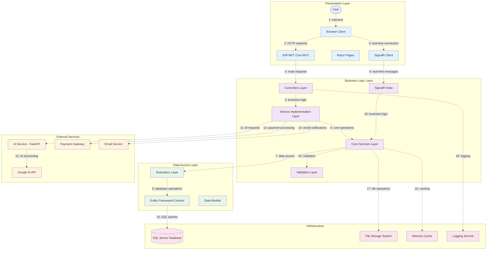
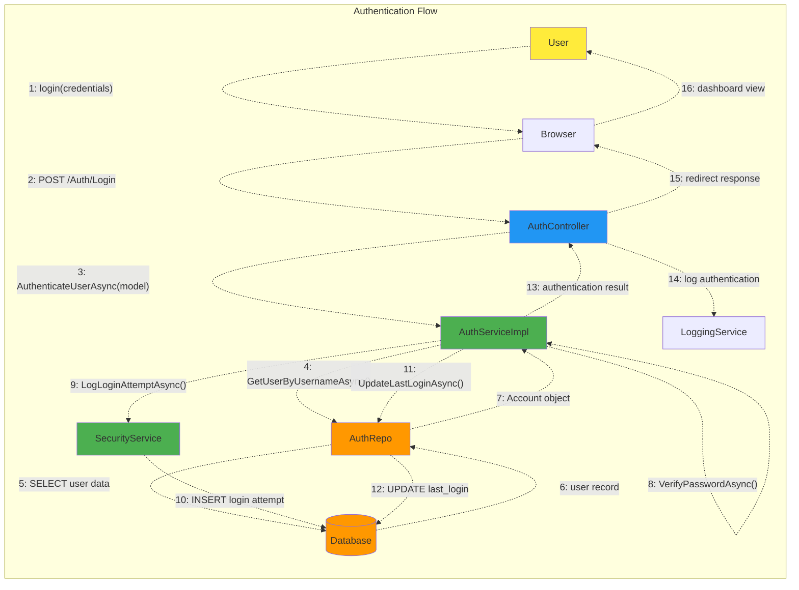
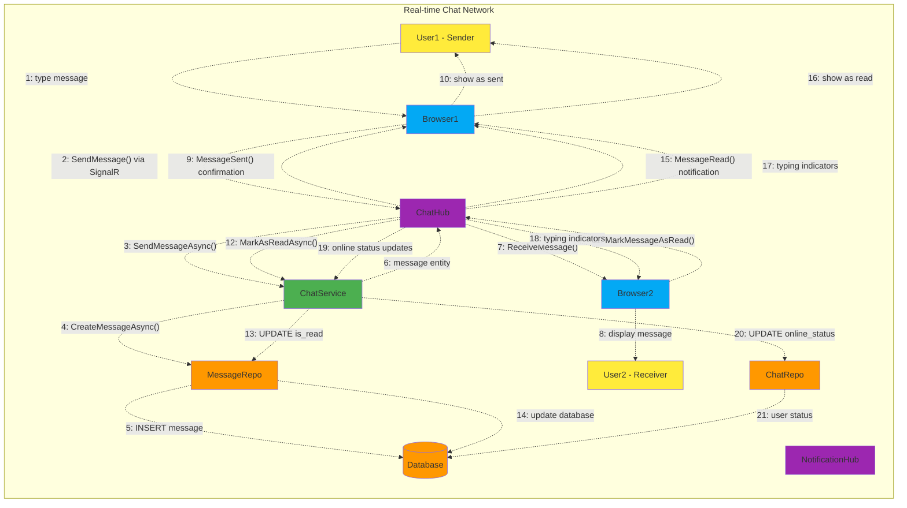
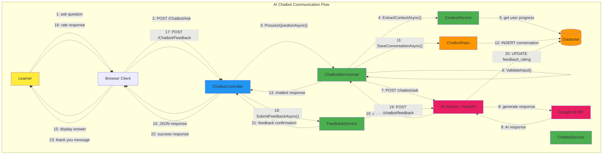

# Communication Diagram - BrainStormEra E-Learning Platform

## Overview
This Communication Diagram (also known as Collaboration Diagram) illustrates the structural organization of objects and their interactions in the BrainStormEra e-learning platform. It shows how objects collaborate through message passing to accomplish system functions.

## System Architecture Overview

### Key Components and Their Relationships



## Detailed Communication Scenarios

### 1. User Authentication Communication



### 2. Course Enrollment Communication

```mermaid
graph TB
    subgraph "Enrollment Communication Network"
        L[Learner]
        BC[Browser Client]
        CC[CourseController]
        CSI[CourseServiceImpl]
        CS[CourseService]
        UR[UserRepo]
        CR[CourseRepo]
        ER[EnrollmentRepo]
        DB[(Database)]
        NH[NotificationHub]
        NS[NotificationService]
        PS[PaymentService]
        PG[Payment Gateway]
    end
    
    L -.->|"1: enroll request"| BC
    BC -.->|"2: POST /Course/Enroll"| CC
    CC -.->|"3: EnrollInCourseAsync()"| CSI
    CSI -.->|"4: IsUserEnrolledAsync()"| CS
    CS -.->|"5: enrollment check"| ER
    ER -.->|"6: SELECT enrollment"| DB
    CSI -.->|"7: GetCourseByIdAsync()"| CS
    CS -.->|"8: course query"| CR
    CR -.->|"9: SELECT course"| DB
    
    alt "Free Course"
        CSI -.->|"10a: EnrollUserAsync()"| CS
        CS -.->|"11a: INSERT enrollment"| ER
        ER -.->|"12a: create record"| DB
    else "Paid Course"
        CSI -.->|"10b: GetUserPaymentPoints()"| UR
        UR -.->|"11b: SELECT payment_point"| DB
        CSI -.->|"12b: ProcessPayment()"| PS
        PS -.->|"13b: payment request"| PG
        PG -.->|"14b: payment confirmation"| PS
        CSI -.->|"15b: BEGIN TRANSACTION"| DB
        CSI -.->|"16b: UPDATE payment_point"| DB
        CSI -.->|"17b: INSERT enrollment"| DB
        CSI -.->|"18b: COMMIT"| DB
    end
    
    CSI -.->|"19: CreateNotificationAsync()"| NS
    NS -.->|"20: INSERT notification"| DB
    NS -.->|"21: SendRealTimeNotification()"| NH
    NH -.->|"22: enrollment notification"| BC
    CSI -.->|"23: enrollment result"| CC
    CC -.->|"24: JSON response"| BC
    BC -.->|"25: success confirmation"| L
    
    classDef user fill:#ffeb3b
    classDef controller fill:#2196f3
    classDef service fill:#4caf50
    classDef data fill:#ff9800
    classDef external fill:#e91e63
    
    class L user
    class CC controller
    class CSI,CS,NS,PS service
    class UR,CR,ER,DB data
    class PG external
```

### 3. Real-time Chat Communication



### 4. AI Chatbot Communication



### 5. Achievement System Communication

```mermaid
graph TB
    subgraph "Achievement System Network"
        LS[Learning System]
        QS[Quiz System]
        AUS[AchievementUnlockService]
        AS[AchievementService]
        ANS[AchievementNotificationService]
        AR[AchievementRepo]
        UAR[UserAchievementRepo]
        NS[NotificationService]
        NH[NotificationHub]
        BC[Browser Client]
        U[User]
        DB[(Database)]
        MC[Memory Cache]
    end
    
    LS -.->|"1: course completed"| AUS
    QS -.->|"2: quiz passed"| AUS
    AUS -.->|"3: CheckAchievementCriteriaAsync()"| AS
    AS -.->|"4: GetUserStatisticsAsync()"| AR
    AR -.->|"5: SELECT user progress"| DB
    AS -.->|"6: GetAchievementsByTypeAsync()"| AR
    AR -.->|"7: SELECT achievements"| DB
    
    loop "For each potential achievement"
        AUS -.->|"8: HasUserAchievementAsync()"| UAR
        UAR -.->|"9: SELECT user_achievements"| DB
        AUS -.->|"10: EvaluateCriteria()"| AUS
        
        alt "Achievement unlocked"
            AUS -.->|"11: ProcessAchievementUnlockAsync()"| UAR
            UAR -.->|"12: INSERT user_achievement"| DB
            AUS -.->|"13: SendAchievementNotificationAsync()"| ANS
            ANS -.->|"14: CreateNotificationAsync()"| NS
            NS -.->|"15: INSERT notification"| DB
            NS -.->|"16: SendRealTimeNotification()"| NH
            NH -.->|"17: achievement notification"| BC
            BC -.->|"18: achievement popup"| U
            AUS -.->|"19: ClearCacheAsync()"| MC
        end
    end
    
    AUS -.->|"20: unlocked achievements list"| LS
    
    classDef system fill:#607d8b
    classDef service fill:#4caf50
    classDef data fill:#ff9800
    classDef notification fill:#9c27b0
    classDef user fill:#ffeb3b
    
    class LS,QS system
    class AUS,AS,ANS,NS service
    class AR,UAR,DB,MC data
    class NH,BC notification
    class U user
```

## Communication Patterns and Message Types

### 1. Synchronous Communication
- **HTTP Request/Response**: User interactions through web interface
- **Method Calls**: Service layer interactions within the application
- **Database Queries**: Entity Framework operations

### 2. Asynchronous Communication
- **SignalR Messages**: Real-time notifications and chat
- **Event-driven Processing**: Achievement unlocking and notifications
- **Background Tasks**: Email sending and file processing

### 3. Message Categories

#### Command Messages
- `EnrollInCourseAsync()`: Enrollment requests
- `CreateCourseAsync()`: Course creation
- `SubmitQuizAsync()`: Quiz submissions
- `SendMessageAsync()`: Chat messages

#### Query Messages
- `GetUserByUsernameAsync()`: User data retrieval
- `GetCourseByIdAsync()`: Course information
- `GetUserAchievementsAsync()`: Achievement data
- `GetNotificationsAsync()`: Notification retrieval

#### Event Messages
- `AchievementUnlocked`: Achievement notifications
- `MessageReceived`: Chat message delivery
- `CourseCompleted`: Course completion events
- `UserOnlineStatusChanged`: Presence updates

## Component Responsibilities

### Presentation Layer
- **User Interface**: Rendering views and handling user interactions
- **Client-side Validation**: Input validation and user feedback
- **Real-time Updates**: SignalR client management

### Business Logic Layer
- **Service Implementation**: Complex business rule enforcement
- **Workflow Orchestration**: Multi-step process coordination
- **External Integration**: API communication with external services

### Data Access Layer
- **Data Persistence**: Database CRUD operations
- **Query Optimization**: Efficient data retrieval
- **Transaction Management**: Data consistency assurance

### Infrastructure Layer
- **Cross-cutting Concerns**: Logging, caching, security
- **External Services**: Email, payment, and AI service integration
- **System Monitoring**: Performance and health monitoring

## Communication Constraints

### Security Constraints
- **Authentication Required**: Most operations require valid user sessions
- **Role-based Authorization**: Operations restricted by user roles
- **Input Validation**: All user inputs validated at multiple layers

### Performance Constraints
- **Caching Strategy**: Frequently accessed data cached in memory
- **Async Operations**: Long-running operations executed asynchronously
- **Connection Pooling**: Database connections managed efficiently

### Reliability Constraints
- **Transaction Management**: Database operations wrapped in transactions
- **Error Handling**: Comprehensive exception handling and logging
- **Retry Logic**: Failed external service calls automatically retried

## Integration Points

### External Service Integration
- **Google AI API**: Natural language processing for chatbot
- **Payment Gateway**: Secure payment processing
- **Email Service**: Notification and verification emails
- **File Storage**: Media and document management

### Internal Service Communication
- **Service Layer**: Business logic coordination
- **Repository Pattern**: Data access abstraction
- **SignalR Hubs**: Real-time communication management
- **Background Services**: Asynchronous task processing

This communication diagram illustrates the collaborative relationships between system components and demonstrates how messages flow through the BrainStormEra e-learning platform to achieve business objectives efficiently and securely. 