# Component Diagram - BrainStormEra E-Learning Platform

## Overview
This Component Diagram illustrates the system architecture of the BrainStormEra e-learning platform, showing the major components, their interfaces, dependencies, and how they interact to deliver the complete educational experience.

## System Architecture

```mermaid
graph TB
    %% External Users and Systems
    subgraph "External Actors"
        Users[👥 Users<br/>Guest, Learner, Instructor, Admin]
        GoogleAI[🤖 Google AI API<br/>Gemini Pro]
        PaymentGW[💳 Payment Gateway<br/>VNPay Integration]
        EmailSvc[📧 Email Service<br/>SMTP Provider]
    end

    %% Presentation Layer Components
    subgraph "Presentation Layer"
        subgraph "Web Applications"
            MVCApp[🌐 BrainStormEra-MVC<br/>ASP.NET Core MVC<br/>Port: 5216]
            RazorApp[📄 BrainStormEra-Razor<br/>Razor Pages<br/>Port: 5274]
        end
        
        subgraph "Client-Side Components"
            WebBrowser[🌍 Web Browser<br/>HTML5/CSS3/JavaScript]
            SignalRClient[📡 SignalR Client<br/>Real-time Communication]
        end
        
        subgraph "External Services"
            ChatService[💬 AI Chat Service<br/>FastAPI Python<br/>Port: 8000]
        end
    end

    %% Business Logic Layer Components
    subgraph "Business Logic Layer"
        subgraph "Service Implementations"
            AuthServiceImpl[🔐 AuthServiceImpl<br/>Authentication Logic]
            CourseServiceImpl[📚 CourseServiceImpl<br/>Course Management]
            QuizServiceImpl[❓ QuizServiceImpl<br/>Assessment Logic]
            NotificationServiceImpl[🔔 NotificationServiceImpl<br/>Notification Management]
            PaymentServiceImpl[💰 PaymentServiceImpl<br/>Payment Processing]
            ChatbotServiceImpl[🤖 ChatbotServiceImpl<br/>AI Integration]
        end
        
        subgraph "Core Services"
            EnrollmentService[📝 EnrollmentService<br/>Course Enrollment]
            AchievementService[🏆 AchievementService<br/>Achievement Management]
            SecurityService[🛡️ SecurityService<br/>Security & Rate Limiting]
            FileService[📁 FileService<br/>File Management]
        end
        
        subgraph "SignalR Hubs"
            ChatHub[💬 ChatHub<br/>Real-time Messaging]
            NotificationHub[🔔 NotificationHub<br/>Live Notifications]
        end
        
        subgraph "Background Services"
            SecurityCleanup[🧹 SecurityCleanupService<br/>Cleanup Tasks]
            StatusSeed[🌱 StatusSeedService<br/>Data Seeding]
            LessonTypeSeed[📖 LessonTypeSeedService<br/>Type Seeding]
        end
    end

    %% Data Access Layer Components
    subgraph "Data Access Layer"
        subgraph "Entity Framework"
            DbContext[🗄️ BrainStormEraContext<br/>EF Core Context]
        end
        
        subgraph "Repository Pattern"
            AuthRepo[🔐 AuthRepo<br/>Authentication Data]
            CourseRepo[📚 CourseRepo<br/>Course Data]
            UserRepo[👤 UserRepo<br/>User Data]
            QuizRepo[❓ QuizRepo<br/>Quiz Data]
            EnrollmentRepo[📝 EnrollmentRepo<br/>Enrollment Data]
            NotificationRepo[🔔 NotificationRepo<br/>Notification Data]
            ChatRepo[💬 ChatRepo<br/>Chat Data]
            AchievementRepo[🏆 AchievementRepo<br/>Achievement Data]
            PaymentRepo[💰 PaymentRepo<br/>Payment Data]
            BaseRepo[📊 BaseRepo&lt;T&gt;<br/>Generic Repository]
        end
        
        subgraph "Data Models"
            Entities[📋 Entity Models<br/>Domain Entities]
            ViewModels[📝 ViewModels<br/>Data Transfer Objects]
        end
    end

    %% Infrastructure Layer Components
    subgraph "Infrastructure Layer"
        subgraph "Database Systems"
            SQLServer[🗃️ SQL Server 2019<br/>Main Database<br/>Port: 1433]
            PostgreSQL[🐘 PostgreSQL 15<br/>Chat Database<br/>Port: 5432]
            Redis[⚡ Redis 7<br/>Caching & Sessions<br/>Port: 6379]
        end
        
        subgraph "Storage & Caching"
            FileStorage[📁 File Storage<br/>SharedMedia]
            MemoryCache[🧠 Memory Cache<br/>In-Memory Caching]
            ResponseCache[📦 Response Cache<br/>HTTP Caching]
        end
        
        subgraph "Cross-Cutting Concerns"
            Logging[📝 Logging Service<br/>Serilog]
            Security[🔒 Security Middleware<br/>Authentication & Authorization]
            Validation[✅ Validation Service<br/>FluentValidation]
            Mapping[🔄 AutoMapper<br/>Object Mapping]
        end
    end

    %% Component Dependencies
    Users --> WebBrowser
    WebBrowser --> MVCApp
    WebBrowser --> RazorApp
    WebBrowser --> SignalRClient
    
    MVCApp --> AuthServiceImpl
    MVCApp --> CourseServiceImpl
    MVCApp --> QuizServiceImpl
    MVCApp --> NotificationServiceImpl
    MVCApp --> PaymentServiceImpl
    
    RazorApp --> AuthServiceImpl
    RazorApp --> NotificationServiceImpl
    RazorApp --> SecurityService
    
    SignalRClient --> ChatHub
    SignalRClient --> NotificationHub
    
    ChatService --> GoogleAI
    ChatService --> PostgreSQL
    ChatService --> Redis
    
    AuthServiceImpl --> AuthRepo
    CourseServiceImpl --> CourseRepo
    QuizServiceImpl --> QuizRepo
    NotificationServiceImpl --> NotificationRepo
    PaymentServiceImpl --> PaymentRepo
    ChatbotServiceImpl --> ChatService
    
    EnrollmentService --> EnrollmentRepo
    AchievementService --> AchievementRepo
    
    ChatHub --> ChatRepo
    NotificationHub --> NotificationRepo
    
    AuthRepo --> DbContext
    CourseRepo --> DbContext
    UserRepo --> DbContext
    QuizRepo --> DbContext
    EnrollmentRepo --> DbContext
    NotificationRepo --> DbContext
    ChatRepo --> DbContext
    AchievementRepo --> DbContext
    PaymentRepo --> DbContext
    BaseRepo --> DbContext
    
    DbContext --> SQLServer
    
    PaymentServiceImpl --> PaymentGW
    NotificationServiceImpl --> EmailSvc
    ChatbotServiceImpl --> GoogleAI
    
    %% Infrastructure Dependencies
    MVCApp --> MemoryCache
    MVCApp --> ResponseCache
    MVCApp --> Logging
    MVCApp --> Security
    MVCApp --> Validation
    MVCApp --> Mapping
    
    RazorApp --> MemoryCache
    RazorApp --> Logging
    RazorApp --> Security
    
    SecurityCleanup --> SecurityService
    StatusSeed --> DbContext
    LessonTypeSeed --> DbContext
    
    Entities --> ViewModels
    DbContext --> Entities
    
    %% File Storage
    MVCApp --> FileStorage
    RazorApp --> FileStorage

    %% Styling
    classDef presentationLayer fill:#e3f2fd
    classDef businessLayer fill:#f3e5f5
    classDef dataLayer fill:#e8f5e8
    classDef infraLayer fill:#fff3e0
    classDef externalLayer fill:#fce4ec
    
    class MVCApp,RazorApp,WebBrowser,SignalRClient,ChatService presentationLayer
    class AuthServiceImpl,CourseServiceImpl,QuizServiceImpl,NotificationServiceImpl,PaymentServiceImpl,ChatbotServiceImpl,EnrollmentService,AchievementService,SecurityService,FileService,ChatHub,NotificationHub,SecurityCleanup,StatusSeed,LessonTypeSeed businessLayer
    class DbContext,AuthRepo,CourseRepo,UserRepo,QuizRepo,EnrollmentRepo,NotificationRepo,ChatRepo,AchievementRepo,PaymentRepo,BaseRepo,Entities,ViewModels dataLayer
    class SQLServer,PostgreSQL,Redis,FileStorage,MemoryCache,ResponseCache,Logging,Security,Validation,Mapping infraLayer
    class Users,GoogleAI,PaymentGW,EmailSvc externalLayer
```



## Component Details

### Presentation Layer Components

#### Web Applications
- **BrainStormEra-MVC**: Primary MVC application handling main user interactions
  - **Port**: 5216 (HTTPS: 7162)
  - **Responsibilities**: Course management, user profiles, assessments
  - **Technologies**: ASP.NET Core MVC, Razor Views, jQuery, Bootstrap

- **BrainStormEra-Razor**: Alternative Razor Pages implementation
  - **Port**: 5274 (HTTPS: 7289)
  - **Responsibilities**: Simplified page-based interactions
  - **Technologies**: ASP.NET Core Razor Pages

#### Client-Side Components
- **Web Browser**: HTML5/CSS3/JavaScript client
  - **Responsibilities**: User interface rendering, client-side validation
  - **Features**: Responsive design, progressive enhancement

- **SignalR Client**: Real-time communication client
  - **Responsibilities**: WebSocket connections, live updates
  - **Features**: Auto-reconnection, connection management

#### External Services
- **AI Chat Service**: Python FastAPI microservice
  - **Port**: 8000
  - **Responsibilities**: AI chatbot, real-time messaging
  - **Technologies**: FastAPI, WebSockets, PostgreSQL, Redis

### Business Logic Layer Components

#### Service Implementations
- **AuthServiceImpl**: Authentication and authorization logic
  - **Methods**: Login, Register, Password Reset, Role Management
  - **Features**: Brute force protection, session management

- **CourseServiceImpl**: Course management operations
  - **Methods**: CRUD operations, approval workflow, category management
  - **Features**: Sequential access control, prerequisite management

- **QuizServiceImpl**: Assessment and evaluation logic
  - **Methods**: Quiz creation, attempt management, auto-grading
  - **Features**: Time limits, attempt restrictions, score calculation

- **NotificationServiceImpl**: Notification management
  - **Methods**: Create, send, mark as read, bulk operations
  - **Features**: Real-time delivery, email integration

- **PaymentServiceImpl**: Payment processing
  - **Methods**: VNPay integration, transaction management
  - **Features**: Secure payments, refund processing

#### Core Services
- **EnrollmentService**: Course enrollment management
- **AchievementService**: Achievement and certification system
- **SecurityService**: Security and rate limiting
- **FileService**: File upload and management

#### SignalR Hubs
- **ChatHub**: Real-time messaging hub
  - **Methods**: SendMessage, MarkAsRead, TypingIndicators
  - **Features**: Group messaging, online status

- **NotificationHub**: Live notification hub
  - **Methods**: SendNotification, JoinGroup, LeaveGroup
  - **Features**: Role-based notifications, real-time delivery

### Data Access Layer Components

#### Repository Pattern
- **BaseRepo<T>**: Generic repository implementation
- **Specialized Repositories**: Entity-specific data access
- **Features**: CRUD operations, LINQ queries, transaction support

#### Entity Framework
- **BrainStormEraContext**: Main database context
  - **Features**: Code-First migrations, relationship mapping
  - **Entities**: 20+ domain entities with complex relationships

### Infrastructure Layer Components

#### Database Systems
- **SQL Server 2019**: Primary relational database
  - **Features**: ACID compliance, stored procedures, indexes
  - **Schema**: Normalized design with referential integrity

- **PostgreSQL 15**: Chat service database
  - **Features**: JSON support, real-time replication
  - **Usage**: Chat messages, AI conversations

- **Redis 7**: Caching and session storage
  - **Features**: In-memory performance, pub/sub messaging
  - **Usage**: Session state, WebSocket connections

#### Cross-Cutting Concerns
- **Logging**: Serilog structured logging
- **Security**: Authentication, authorization, HTTPS
- **Validation**: FluentValidation business rules
- **Mapping**: AutoMapper object transformation

## Component Interfaces

### Service Interfaces
```csharp
// Authentication Service Interface
public interface IAuthService
{
    Task<LoginResult> AuthenticateUserAsync(LoginModel model);
    Task<bool> RegisterUserAsync(RegisterModel model);
    Task<bool> ResetPasswordAsync(string email);
}

// Course Service Interface  
public interface ICourseService
{
    Task<Course> CreateCourseAsync(CreateCourseModel model);
    Task<List<Course>> GetCoursesAsync(CourseFilterModel filter);
    Task<bool> ApproveCourseAsync(string courseId, string adminId);
}

// Repository Interface
public interface IBaseRepo<T> where T : class
{
    Task<T> GetByIdAsync(object id);
    Task<List<T>> GetAllAsync();
    Task<T> AddAsync(T entity);
    Task<bool> UpdateAsync(T entity);
    Task<bool> DeleteAsync(object id);
}
```

### SignalR Hub Interfaces
```csharp
// Chat Hub Client Interface
public interface IChatClient
{
    Task ReceiveMessage(string userId, string message);
    Task MessageRead(string messageId);
    Task UserTyping(string userId, bool isTyping);
    Task UserOnlineStatusChanged(string userId, bool isOnline);
}

// Notification Hub Client Interface
public interface INotificationClient
{
    Task ReceiveNotification(NotificationModel notification);
    Task NotificationRead(string notificationId);
    Task BulkNotification(List<NotificationModel> notifications);
}
```

## Component Dependencies

### Dependency Flow
1. **Presentation → Business Logic**: Web apps depend on service implementations
2. **Business Logic → Data Access**: Services depend on repositories
3. **Data Access → Infrastructure**: Repositories depend on database context
4. **Infrastructure → External**: Database and external service integrations

### Dependency Injection
- **Scoped Services**: Request-scoped for web requests
- **Singleton Services**: Application-wide caching and configuration
- **Transient Services**: Short-lived utility services

## Deployment Considerations

### Scaling Strategy
- **Horizontal Scaling**: Multiple web app instances behind load balancer
- **Database Scaling**: Read replicas, connection pooling
- **Cache Strategy**: Distributed Redis for session state
- **CDN Integration**: Static assets and media files

### Performance Optimization
- **Response Compression**: Gzip compression enabled
- **Response Caching**: HTTP caching middleware
- **Memory Caching**: In-memory caching for frequently accessed data
- **Database Optimization**: Indexed queries, lazy loading

### Security Architecture
- **Defense in Depth**: Multiple security layers
- **Input Validation**: Client and server-side validation
- **Authentication**: Cookie-based with JWT tokens
- **Authorization**: Role-based access control
- **Data Protection**: Encrypted sensitive data

This component diagram provides a comprehensive view of the BrainStormEra architecture, showing how each component contributes to the overall system functionality while maintaining clear separation of concerns and dependency management. 