# Database Schema - BrainStormEra E-Learning Platform

## Overview
This Database Schema diagram illustrates the complete relational database design for the BrainStormEra e-learning platform, showing all entities, relationships, constraints, and data types used in the SQL Server database.

## Entity Relationship Diagram

```mermaid
erDiagram
    %% Core User Management
    account {
        string user_id PK "UUID Primary Key"
        string user_role "Role: Guest, Learner, Instructor, Admin"
        string username UK "Unique Username"
        string password_hash "Hashed Password"
        string user_email UK "Unique Email"
        string full_name "Full Name"
        decimal payment_point "Virtual Payment Points"
        date date_of_birth "Date of Birth"
        smallint gender "0=Other, 1=Male, 2=Female"
        string phone_number "Contact Number"
        string user_address "Physical Address"
        string user_image "Profile Image Path"
        boolean is_banned "Account Status"
        string bank_account_number "Bank Account"
        string bank_name "Bank Name"
        string account_holder_name "Account Holder"
        datetime last_login "Last Login Time"
        datetime account_created_at "Created Date"
        datetime account_updated_at "Updated Date"
    }

    %% Course Management
    course_category {
        string course_category_id PK "UUID Primary Key"
        string course_category_name "Category Name"
        string category_description "Category Description"
        string category_icon "Icon Path"
        boolean is_active "Active Status"
        datetime created_at "Created Date"
        datetime update_at "Updated Date"
    }

    course {
        string course_id PK "UUID Primary Key"
        string author_id FK "Course Author"
        string course_name "Course Title"
        string course_description "Course Description"
        int course_status FK "Status Reference"
        string course_image "Course Thumbnail"
        decimal price "Course Price"
        int estimated_duration "Duration in Minutes"
        tinyint difficulty_level "1-5 Difficulty Scale"
        boolean is_featured "Featured Status"
        string approval_status "draft, pending, approved, rejected"
        string approved_by FK "Admin Approver"
        datetime approved_at "Approval Date"
        boolean enforce_sequential_access "Sequential Learning"
        boolean allow_lesson_preview "Preview Allowed"
        datetime course_created_at "Created Date"
        datetime course_updated_at "Updated Date"
    }

    course_category_mapping {
        string course_id PK,FK "Course Reference"
        string course_category_id PK,FK "Category Reference"
    }

    %% Learning Structure
    chapter {
        string chapter_id PK "UUID Primary Key"
        string course_id FK "Course Reference"
        string chapter_name "Chapter Title"
        string chapter_description "Chapter Description"
        int chapter_order "Display Order"
        int chapter_status FK "Status Reference"
        boolean is_locked "Lock Status"
        string unlock_after_chapter_id FK "Prerequisite Chapter"
        datetime chapter_created_at "Created Date"
        datetime chapter_updated_at "Updated Date"
    }

    lesson_type {
        int lesson_type_id PK "Type ID"
        string lesson_type_name "Type Name: Video, Text, Quiz"
    }

    lesson {
        string lesson_id PK "UUID Primary Key"
        string chapter_id FK "Chapter Reference"
        string lesson_name "Lesson Title"
        string lesson_description "Lesson Description"
        string lesson_content "Lesson Content HTML"
        int lesson_order "Display Order"
        int lesson_type_id FK "Lesson Type"
        int lesson_status FK "Status Reference"
        boolean is_locked "Lock Status"
        string unlock_after_lesson_id FK "Prerequisite Lesson"
        decimal min_completion_percentage "Minimum Completion %"
        int min_time_spent "Minimum Time (seconds)"
        datetime access_time "Access Time"
        boolean is_mandatory "Mandatory Status"
        boolean requires_quiz_pass "Quiz Required"
        decimal min_quiz_score "Minimum Quiz Score"
        datetime lesson_created_at "Created Date"
        datetime lesson_updated_at "Updated Date"
    }

    lesson_prerequisite {
        string lesson_id PK,FK "Lesson Reference"
        string prerequisite_lesson_id PK,FK "Prerequisite Reference"
        string prerequisite_type "completion, quiz_pass, time_spent"
        decimal required_score "Required Score"
        int required_time "Required Time (seconds)"
        datetime created_at "Created Date"
    }

    %% Assessment System
    quiz {
        string quiz_id PK "UUID Primary Key"
        string lesson_id FK "Lesson Reference"
        string course_id FK "Course Reference"
        string quiz_name "Quiz Title"
        string quiz_description "Quiz Description"
        int time_limit "Time Limit (minutes)"
        decimal passing_score "Passing Score %"
        int max_attempts "Maximum Attempts"
        int quiz_status FK "Status Reference"
        boolean is_final_quiz "Final Quiz Flag"
        boolean is_prerequisite_quiz "Prerequisite Flag"
        boolean blocks_lesson_completion "Blocking Flag"
        datetime quiz_created_at "Created Date"
        datetime quiz_updated_at "Updated Date"
    }

    question {
        string question_id PK "UUID Primary Key"
        string quiz_id FK "Quiz Reference"
        string question_text "Question Content"
        string question_type "single_choice, multiple_choice, text"
        decimal points "Question Points"
        int question_order "Display Order"
        string explanation "Answer Explanation"
        datetime question_created_at "Created Date"
    }

    answer_option {
        string option_id PK "UUID Primary Key"
        string question_id FK "Question Reference"
        string option_text "Option Content"
        boolean is_correct "Correct Answer Flag"
        int option_order "Display Order"
    }

    quiz_attempt {
        string attempt_id PK "UUID Primary Key"
        string user_id FK "User Reference"
        string quiz_id FK "Quiz Reference"
        datetime start_time "Attempt Start Time"
        datetime end_time "Attempt End Time"
        decimal score "Final Score"
        boolean is_passed "Pass Status"
        boolean is_completed "Completion Status"
        int attempt_number "Attempt Number"
    }

    user_answer {
        string user_id PK,FK "User Reference"
        string question_id PK,FK "Question Reference"
        string attempt_id PK,FK "Attempt Reference"
        string selected_option_id FK "Selected Option"
        string selected_option_ids "Multiple Choice IDs"
        string answer_text "Text Answer"
        boolean is_correct "Correctness Flag"
        decimal points_earned "Points Earned"
    }

    %% Enrollment & Progress
    status {
        int status_id PK "Status ID"
        string status_name "Status Name"
    }

    enrollment {
        string enrollment_id PK "UUID Primary Key"
        string user_id FK "User Reference"
        string course_id FK "Course Reference"
        int enrollment_status FK "Status Reference"
        boolean approved "Approval Status"
        decimal progress_percentage "Progress %"
        date certificate_issued_date "Certificate Date"
        string current_lesson_id FK "Current Lesson"
        string last_accessed_lesson_id FK "Last Accessed Lesson"
        datetime enrollment_created_at "Created Date"
        datetime enrollment_updated_at "Updated Date"
    }

    user_progress {
        string user_id PK,FK "User Reference"
        string lesson_id PK,FK "Lesson Reference"
        boolean is_completed "Completion Status"
        decimal progress_percentage "Progress %"
        int time_spent "Time Spent (seconds)"
        datetime last_accessed_at "Last Access Time"
        datetime completed_at "Completion Time"
        int access_count "Access Count"
        datetime first_accessed_at "First Access Time"
        boolean is_unlocked "Unlock Status"
        datetime unlocked_at "Unlock Time"
        boolean meets_time_requirement "Time Requirement Met"
        boolean meets_percentage_requirement "Percentage Requirement Met"
        boolean meets_quiz_requirement "Quiz Requirement Met"
    }

    %% Achievement System
    achievement {
        string achievement_id PK "UUID Primary Key"
        string achievement_name "Achievement Name"
        string achievement_description "Achievement Description"
        string achievement_icon "Icon Path"
        string unlock_criteria "JSON Unlock Criteria"
        int points_reward "Points Reward"
        string achievement_type "course_completion, quiz_master, streak"
        boolean is_active "Active Status"
        datetime created_at "Created Date"
    }

    user_achievement {
        string user_achievement_id PK "UUID Primary Key"
        string user_id FK "User Reference"
        string achievement_id FK "Achievement Reference"
        string course_id FK "Course Reference (optional)"
        string enrollment_id FK "Enrollment Reference (optional)"
        datetime unlocked_at "Unlock Time"
        boolean is_notified "Notification Status"
        string unlock_context "Unlock Context JSON"
    }

    certificate {
        string certificate_id PK "UUID Primary Key"
        string user_id FK "User Reference"
        string course_id FK "Course Reference"
        string enrollment_id FK "Enrollment Reference"
        string certificate_name "Certificate Name"
        datetime issue_date "Issue Date"
        string certificate_url "Certificate File Path"
        boolean is_verified "Verification Status"
        string verification_code "Verification Code"
    }

    %% Communication System
    conversation {
        string conversation_id PK "UUID Primary Key"
        string conversation_type "private, group"
        string created_by FK "Creator Reference"
        boolean is_active "Active Status"
        string last_message_id FK "Last Message Reference"
        datetime last_message_at "Last Message Time"
        datetime conversation_created_at "Created Date"
        datetime conversation_updated_at "Updated Date"
    }

    conversation_participant {
        string conversation_id PK,FK "Conversation Reference"
        string user_id PK,FK "User Reference"
        string participant_role "admin, moderator, member"
        datetime joined_at "Join Time"
        datetime left_at "Leave Time"
        boolean is_active "Active Status"
        boolean is_muted "Mute Status"
        string last_read_message_id FK "Last Read Message"
        datetime last_read_at "Last Read Time"
    }

    message_entity {
        string message_id PK "UUID Primary Key"
        string sender_id FK "Sender Reference"
        string receiver_id FK "Receiver Reference"
        string conversation_id FK "Conversation Reference"
        string message_content "Message Content"
        string message_type "text, image, file, link, system"
        string attachment_url "Attachment URL"
        string attachment_name "Attachment Name"
        bigint attachment_size "Attachment Size"
        boolean is_read "Read Status"
        datetime read_at "Read Time"
        boolean is_deleted_by_sender "Sender Delete Status"
        boolean is_deleted_by_receiver "Receiver Delete Status"
        string reply_to_message_id FK "Reply Reference"
        boolean is_edited "Edit Status"
        datetime edited_at "Edit Time"
        string original_content "Original Content"
        datetime message_created_at "Created Date"
        datetime message_updated_at "Updated Date"
    }

    %% AI Chatbot System
    chatbot_conversation {
        string conversation_id PK "UUID Primary Key"
        string user_id FK "User Reference"
        string session_id "Session Identifier"
        string context_page "Current Page Context"
        string context_course_id FK "Course Context"
        datetime conversation_started_at "Start Time"
        datetime last_message_at "Last Message Time"
        boolean is_active "Active Status"
        string conversation_summary "AI Summary"
    }

    %% Notification System
    notification {
        string notification_id PK "UUID Primary Key"
        string user_id FK "User Reference"
        string course_id FK "Course Reference (optional)"
        string created_by FK "Creator Reference"
        string notification_type "achievement, message, course_update, system"
        string title "Notification Title"
        string message "Notification Message"
        boolean is_read "Read Status"
        datetime read_at "Read Time"
        datetime created_at "Created Date"
        string action_url "Action URL"
        string metadata "Additional Data JSON"
    }

    %% Payment System
    payment_method {
        int payment_method_id PK "Payment Method ID"
        string method_name "Method Name: VNPay, Credit Card"
        boolean is_active "Active Status"
    }

    payment_transaction {
        string transaction_id PK "UUID Primary Key"
        string user_id FK "User Reference"
        string recipient_id FK "Recipient Reference"
        string course_id FK "Course Reference"
        decimal amount "Transaction Amount"
        string currency "Currency Code"
        int payment_method_id FK "Payment Method"
        string transaction_type "enrollment, refund, points"
        string status "pending, completed, failed, refunded"
        string external_transaction_id "External Payment ID"
        datetime transaction_date "Transaction Date"
        string payment_details "Payment Details JSON"
        string failure_reason "Failure Reason"
    }

    %% Feedback System
    feedback {
        string feedback_id PK "UUID Primary Key"
        string user_id FK "User Reference"
        string course_id FK "Course Reference"
        int rating "Rating 1-5"
        string feedback_text "Feedback Content"
        datetime created_at "Created Date"
        boolean is_verified "Verification Status"
        string response "Instructor Response"
        datetime response_date "Response Date"
    }

    %% Relationships
    account ||--o{ course : "creates"
    account ||--o{ enrollment : "enrolls"
    account ||--o{ user_progress : "tracks"
    account ||--o{ user_achievement : "earns"
    account ||--o{ quiz_attempt : "attempts"
    account ||--o{ user_answer : "answers"
    account ||--o{ conversation : "creates"
    account ||--o{ conversation_participant : "participates"
    account ||--o{ message_entity : "sends"
    account ||--o{ message_entity : "receives"
    account ||--o{ chatbot_conversation : "chats"
    account ||--o{ notification : "receives"
    account ||--o{ payment_transaction : "makes"
    account ||--o{ certificate : "receives"
    account ||--o{ feedback : "provides"

    course ||--o{ chapter : "contains"
    course ||--o{ enrollment : "enrolled"
    course ||--o{ quiz : "has"
    course ||--o{ user_achievement : "unlocks"
    course ||--o{ certificate : "issues"
    course ||--o{ payment_transaction : "purchased"
    course ||--o{ feedback : "receives"
    course ||--o{ notification : "triggers"
    course }|--|| course_category_mapping : "categorized"

    course_category ||--o{ course_category_mapping : "categorizes"

    chapter ||--o{ lesson : "contains"
    chapter ||--o{ chapter : "unlocks"

    lesson ||--o{ quiz : "includes"
    lesson ||--o{ user_progress : "tracked"
    lesson ||--o{ lesson_prerequisite : "requires"
    lesson ||--o{ lesson_prerequisite : "prerequisite"
    lesson ||--o{ lesson : "unlocks"
    lesson }|--|| lesson_type : "typed"

    quiz ||--o{ question : "contains"
    quiz ||--o{ quiz_attempt : "attempted"

    question ||--o{ answer_option : "has"
    question ||--o{ user_answer : "answered"

    quiz_attempt ||--o{ user_answer : "includes"

    achievement ||--o{ user_achievement : "awarded"

    conversation ||--o{ conversation_participant : "includes"
    conversation ||--o{ message_entity : "contains"

    message_entity ||--o{ message_entity : "replies"

    status ||--o{ course : "status"
    status ||--o{ chapter : "status"
    status ||--o{ lesson : "status"
    status ||--o{ quiz : "status"
    status ||--o{ enrollment : "status"

    payment_method ||--o{ payment_transaction : "used"

    enrollment ||--o{ user_achievement : "generates"
    enrollment ||--o{ certificate : "generates"
```



## Database Constraints and Indexes

### Primary Keys
All tables use UUID (VARCHAR(36)) primary keys for better distributed system support and security.

### Foreign Key Constraints
- **account.user_id** referenced by 15+ tables
- **course.course_id** referenced by 10+ tables  
- **Cascade Deletes**: Limited to prevent data loss
- **Referential Integrity**: Enforced at database level

### Unique Constraints
- **account.username**: Unique usernames
- **account.user_email**: Unique email addresses
- **achievement.achievement_name**: Unique achievement names
- **course_category.course_category_name**: Unique category names

### Check Constraints
```sql
-- Gender validation
ALTER TABLE account ADD CONSTRAINT CK_account_gender 
CHECK (gender IN (0, 1, 2));

-- Difficulty level validation  
ALTER TABLE course ADD CONSTRAINT CK_course_difficulty 
CHECK (difficulty_level BETWEEN 1 AND 5);

-- Progress percentage validation
ALTER TABLE enrollment ADD CONSTRAINT CK_enrollment_progress 
CHECK (progress_percentage BETWEEN 0 AND 100);

-- Rating validation
ALTER TABLE feedback ADD CONSTRAINT CK_feedback_rating 
CHECK (rating BETWEEN 1 AND 5);
```

### Performance Indexes
```sql
-- User lookup indexes
CREATE INDEX IX_account_email ON account(user_email);
CREATE INDEX IX_account_username ON account(username);
CREATE INDEX IX_account_role ON account(user_role);

-- Course discovery indexes
CREATE INDEX IX_course_status ON course(course_status, is_featured);
CREATE INDEX IX_course_author ON course(author_id);
CREATE INDEX IX_course_approval ON course(approval_status);

-- Learning progress indexes
CREATE INDEX IX_enrollment_user_course ON enrollment(user_id, course_id);
CREATE INDEX IX_user_progress_user_lesson ON user_progress(user_id, lesson_id);
CREATE INDEX IX_user_progress_completion ON user_progress(user_id, is_completed);

-- Assessment indexes
CREATE INDEX IX_quiz_attempt_user_quiz ON quiz_attempt(user_id, quiz_id);
CREATE INDEX IX_user_answer_attempt ON user_answer(attempt_id);

-- Communication indexes
CREATE INDEX IX_message_conversation ON message_entity(conversation_id, message_created_at);
CREATE INDEX IX_conversation_participant_user ON conversation_participant(user_id, is_active);

-- Notification indexes
CREATE INDEX IX_notification_user_read ON notification(user_id, is_read, created_at);
```

## Data Types and Storage

### String Fields
- **IDs**: VARCHAR(36) for UUIDs
- **Names/Titles**: NVARCHAR(255) for Unicode support
- **Content**: NVARCHAR(MAX) for large text content
- **Enums**: VARCHAR(50) for status fields

### Numeric Fields
- **Prices/Points**: DECIMAL(10,2) for monetary values
- **Percentages**: DECIMAL(5,2) for progress/scores
- **Counters**: INT for counts and IDs
- **Flags**: BIT for boolean values

### Date/Time Fields
- **Timestamps**: DATETIME for precision
- **Dates**: DATE for date-only fields
- **Default Values**: GETDATE() for creation timestamps

## Business Rules Enforced

### User Management
- Unique usernames and emails
- Password complexity enforced at application level
- Account status tracking with ban functionality

### Course Structure
- Sequential course-chapter-lesson hierarchy
- Prerequisite enforcement at database level
- Approval workflow for course publishing

### Assessment System
- Time-limited quiz attempts
- Maximum attempt restrictions
- Automatic score calculation and pass/fail determination

### Progress Tracking
- Granular lesson-level progress tracking
- Completion criteria enforcement
- Achievement unlocking based on progress

### Security
- Soft delete patterns for audit trails
- User permission validation
- Encrypted sensitive data storage

This database schema provides a robust foundation for the BrainStormEra e-learning platform, supporting complex educational workflows while maintaining data integrity and performance. 