# Deployment Diagram - BrainStormEra E-Learning Platform

## Overview
This Deployment Diagram illustrates the physical deployment architecture of the BrainStormEra e-learning platform, showing hardware nodes, software components, network connections, and the runtime environment configuration for both development and production environments.

## Production Deployment Architecture

```mermaid
graph TB
    %% Internet and Load Balancer
    subgraph "Internet"
        Users[👥 End Users<br/>Web Browsers<br/>Mobile Devices]
        CDN[🌐 Content Delivery Network<br/>CloudFlare/Azure CDN<br/>Static Assets & Media]
    end

    subgraph "DMZ - Public Network"
        LoadBalancer[⚖️ Load Balancer<br/>Nginx/Azure Load Balancer<br/>HTTPS Termination<br/>Port 443/80]
        ReverseProxy[🔄 Reverse Proxy<br/>Nginx<br/>Request Routing<br/>SSL/TLS]
    end

    %% Web Tier
    subgraph "Web Tier - Private Subnet"
        subgraph "Web Server 1"
            WebApp1[🌐 BrainStormEra-MVC<br/>ASP.NET Core 8.0<br/>IIS/Kestrel<br/>Port 5216]
            RazorApp1[📄 BrainStormEra-Razor<br/>ASP.NET Core 8.0<br/>IIS/Kestrel<br/>Port 5274]
        end
        
        subgraph "Web Server 2"
            WebApp2[🌐 BrainStormEra-MVC<br/>ASP.NET Core 8.0<br/>IIS/Kestrel<br/>Port 5216]
            RazorApp2[📄 BrainStormEra-Razor<br/>ASP.NET Core 8.0<br/>IIS/Kestrel<br/>Port 5274]
        end
        
        subgraph "Microservices Server"
            ChatService[💬 AI Chat Service<br/>Python FastAPI<br/>Uvicorn<br/>Port 8000]
            ChatDB[🐘 PostgreSQL 15<br/>Chat Database<br/>Port 5432]
            RedisCache[⚡ Redis 7<br/>Cache & Sessions<br/>Port 6379]
        end
    end

    %% Application Tier
    subgraph "Application Tier - Private Subnet"
        subgraph "Application Server"
            BusinessLogic[🧠 Business Logic Layer<br/>.NET 8.0 Runtime<br/>Service Implementations]
            BackgroundSvcs[⚙️ Background Services<br/>Security Cleanup<br/>Data Seeding]
            SignalRHubs[📡 SignalR Hubs<br/>WebSocket Server<br/>Real-time Communication]
        end
        
        subgraph "File Server"
            FileStorage[📁 File Storage<br/>Shared Media<br/>NFS/Azure Files<br/>Documents & Images]
        end
    end

    %% Data Tier
    subgraph "Data Tier - Private Subnet"
        subgraph "Primary Database Server"
            SQLServerPrimary[🗃️ SQL Server 2019<br/>Primary Database<br/>Port 1433<br/>Always On Availability]
        end
        
        subgraph "Secondary Database Server"
            SQLServerSecondary[🗃️ SQL Server 2019<br/>Read Replica<br/>Port 1433<br/>Disaster Recovery]
        end
        
        subgraph "Cache Cluster"
            RedisCluster[⚡ Redis Cluster<br/>Distributed Cache<br/>High Availability<br/>Port 6379]
        end
    end

    %% External Services
    subgraph "External Services - Internet"
        GoogleAI[🤖 Google AI API<br/>Gemini Pro<br/>HTTPS/443<br/>Chatbot Intelligence]
        PaymentGW[💳 VNPay Gateway<br/>Payment Processing<br/>HTTPS/443<br/>Secure Transactions]
        EmailSMTP[📧 SMTP Service<br/>Email Delivery<br/>Port 587/465<br/>Notifications]
        Monitoring[📊 Monitoring Service<br/>Application Insights<br/>Health Monitoring]
    end

    %% Development Environment
    subgraph "Development Environment"
        DevMachine[💻 Developer Machine<br/>Visual Studio 2022<br/>Docker Desktop<br/>Local Development]
        
        subgraph "Docker Containers"
            DockerMVC[🐳 MVC Container<br/>ASP.NET Core<br/>Port 5000]
            DockerRazor[🐳 Razor Container<br/>ASP.NET Core<br/>Port 5001]
            DockerSQL[🐳 SQL Server Container<br/>mcr.microsoft.com/mssql/server:2022<br/>Port 1433]
            DockerChat[🐳 Chat Service Container<br/>Python FastAPI<br/>Port 8000]
            DockerRedis[🐳 Redis Container<br/>redis:7-alpine<br/>Port 6379]
            DockerPostgres[🐳 PostgreSQL Container<br/>postgres:15-alpine<br/>Port 5432]
        end
    end

    %% Network Connections
    Users --> CDN
    Users --> LoadBalancer
    CDN --> FileStorage
    
    LoadBalancer --> ReverseProxy
    ReverseProxy --> WebApp1
    ReverseProxy --> WebApp2
    ReverseProxy --> RazorApp1
    ReverseProxy --> RazorApp2
    ReverseProxy --> ChatService
    
    WebApp1 --> BusinessLogic
    WebApp2 --> BusinessLogic
    RazorApp1 --> BusinessLogic
    RazorApp2 --> BusinessLogic
    
    BusinessLogic --> SQLServerPrimary
    BusinessLogic --> RedisCluster
    BusinessLogic --> FileStorage
    
    ChatService --> ChatDB
    ChatService --> RedisCache
    ChatService --> GoogleAI
    
    SQLServerPrimary --> SQLServerSecondary
    
    WebApp1 --> PaymentGW
    WebApp2 --> PaymentGW
    BusinessLogic --> EmailSMTP
    
    %% Development connections
    DevMachine --> DockerMVC
    DevMachine --> DockerRazor
    DockerMVC --> DockerSQL
    DockerRazor --> DockerSQL
    DockerChat --> DockerPostgres
    DockerChat --> DockerRedis
    
    %% Monitoring connections
    WebApp1 -.-> Monitoring
    WebApp2 -.-> Monitoring
    ChatService -.-> Monitoring
    SQLServerPrimary -.-> Monitoring

    %% Styling
    classDef internet fill:#e3f2fd
    classDef dmz fill:#fff3e0
    classDef webTier fill:#e8f5e8
    classDef appTier fill:#f3e5f5
    classDef dataTier fill:#fce4ec
    classDef external fill:#f0f4c3
    classDef development fill:#e1f5fe
    
    class Users,CDN internet
    class LoadBalancer,ReverseProxy dmz
    class WebApp1,WebApp2,RazorApp1,RazorApp2,ChatService,ChatDB,RedisCache webTier
    class BusinessLogic,BackgroundSvcs,SignalRHubs,FileStorage appTier
    class SQLServerPrimary,SQLServerSecondary,RedisCluster dataTier
    class GoogleAI,PaymentGW,EmailSMTP,Monitoring external
    class DevMachine,DockerMVC,DockerRazor,DockerSQL,DockerChat,DockerRedis,DockerPostgres development
```



## Infrastructure Specifications

### Hardware Requirements

#### Production Environment

**Web Servers (2 instances)**
- **CPU**: 8 cores (Intel Xeon or AMD EPYC)
- **RAM**: 16 GB DDR4
- **Storage**: 500 GB SSD (OS + Application)
- **Network**: 1 Gbps ethernet
- **OS**: Windows Server 2022 or Ubuntu 20.04 LTS

**Application Server**
- **CPU**: 12 cores (Intel Xeon or AMD EPYC)
- **RAM**: 32 GB DDR4
- **Storage**: 1 TB SSD (Application + Logs)
- **Network**: 1 Gbps ethernet
- **OS**: Windows Server 2022 or Ubuntu 20.04 LTS

**Database Servers (Primary + Secondary)**
- **CPU**: 16 cores (Intel Xeon or AMD EPYC)
- **RAM**: 64 GB DDR4
- **Storage**: 2 TB NVMe SSD (Database) + 1 TB SSD (Logs)
- **Network**: 10 Gbps ethernet
- **OS**: Windows Server 2022 or Linux

**File Server**
- **CPU**: 4 cores
- **RAM**: 8 GB DDR4
- **Storage**: 5 TB HDD (Shared Media)
- **Network**: 1 Gbps ethernet
- **Backup**: RAID 1 configuration

#### Development Environment

**Developer Workstation**
- **CPU**: 8 cores (Intel Core i7 or AMD Ryzen 7)
- **RAM**: 32 GB DDR4
- **Storage**: 1 TB NVMe SSD
- **Network**: Wi-Fi 6 or Gigabit Ethernet
- **OS**: Windows 11 Pro or macOS

### Software Components

#### Runtime Environment

**Web Tier**
```yaml
Operating System: Windows Server 2022 / Ubuntu 20.04
Web Server: IIS 10.0 / Nginx 1.20
Runtime: .NET 8.0 Runtime
Application Server: Kestrel
Process Manager: IIS Application Pool / systemd
```

**Application Tier**
```yaml
Runtime Environment: .NET 8.0
Service Host: ASP.NET Core Host
Background Services: .NET Hosted Services
Real-time Communication: SignalR
Dependency Injection: Built-in DI Container
```

**Data Tier**
```yaml
Database Engine: SQL Server 2019 Enterprise
Cache Engine: Redis 7.0
ORM: Entity Framework Core 8.0
Connection Pooling: Built-in EF Connection Pool
Migration Tool: EF Core Migrations
```

#### Microservices Environment

**Chat Service**
```yaml
Runtime: Python 3.11
Web Framework: FastAPI 0.104+
ASGI Server: Uvicorn
Database: PostgreSQL 15
Cache: Redis 7
Process Manager: Gunicorn (Production)
```

### Network Architecture

#### Security Zones

**DMZ (Demilitarized Zone)**
- **Purpose**: Public-facing components
- **Components**: Load Balancer, Reverse Proxy
- **Access**: Internet → DMZ (HTTPS/443, HTTP/80)
- **Security**: WAF, DDoS protection

**Web Tier**
- **Purpose**: Application hosting
- **Components**: MVC Apps, Razor Apps, Chat Service
- **Access**: DMZ → Web Tier (Internal ports)
- **Security**: Internal firewall, VPN access

**Application Tier**
- **Purpose**: Business logic processing
- **Components**: Service Layer, Background Services
- **Access**: Web Tier → App Tier (Internal)
- **Security**: Service mesh, internal authentication

**Data Tier**
- **Purpose**: Data persistence
- **Components**: Databases, Cache clusters
- **Access**: App Tier → Data Tier (Internal)
- **Security**: Database firewall, encrypted connections

#### Port Configuration

**Public Ports**
```
443 (HTTPS) - Load Balancer → Web Tier
80 (HTTP)   - Redirect to HTTPS
```

**Internal Ports**
```
5216  - BrainStormEra-MVC
5274  - BrainStormEra-Razor
8000  - AI Chat Service
1433  - SQL Server
5432  - PostgreSQL
6379  - Redis
```

### Container Orchestration

#### Docker Configuration

**Development Environment**
```yaml
version: '3.8'
services:
  mvc:
    image: brainstormera/mvc:latest
    ports: ["5000:5000"]
    environment:
      - ASPNETCORE_ENVIRONMENT=Development
      - ConnectionStrings__DefaultConnection=Server=database;...
    
  razor:
    image: brainstormera/razor:latest
    ports: ["5001:5001"]
    
  database:
    image: mcr.microsoft.com/mssql/server:2022-latest
    environment:
      - SA_PASSWORD=YourStrong@Passw0rd
      - ACCEPT_EULA=Y
    
  chat-service:
    image: brainstormera/chat:latest
    ports: ["8000:8000"]
    
  redis:
    image: redis:7-alpine
    ports: ["6379:6379"]
```

#### Production Orchestration

**Kubernetes Deployment** (Optional)
```yaml
apiVersion: apps/v1
kind: Deployment
metadata:
  name: brainstormera-mvc
spec:
  replicas: 3
  selector:
    matchLabels:
      app: mvc
  template:
    metadata:
      labels:
        app: mvc
    spec:
      containers:
      - name: mvc
        image: brainstormera/mvc:latest
        ports:
        - containerPort: 5000
        env:
        - name: ASPNETCORE_ENVIRONMENT
          value: "Production"
```

### Security Configuration

#### SSL/TLS Configuration

**Certificate Management**
- **Load Balancer**: Wildcard SSL certificate (*.brainstormera.com)
- **Internal Communication**: Self-signed certificates or service mesh
- **Database**: TLS encryption for data in transit

**Firewall Rules**
```
DMZ → Web Tier:     TCP 5216, 5274, 8000
Web Tier → App Tier: TCP 443, Internal APIs  
App Tier → Data Tier: TCP 1433, 5432, 6379
External APIs:      TCP 443 (Outbound)
```

#### Authentication & Authorization

**Identity Provider**
- **Primary**: ASP.NET Core Identity
- **External**: Google OAuth (Optional)
- **API**: JWT tokens for microservices

**Role-Based Access**
```
Guest     → Public content only
Learner   → Course access, messaging
Instructor → Content creation, analytics  
Admin     → Full system access
```

### Monitoring & Logging

#### Application Monitoring

**Metrics Collection**
- **Application Insights**: Performance monitoring
- **Custom Metrics**: Business KPIs
- **Health Checks**: Endpoint monitoring
- **Error Tracking**: Exception logging

**Log Aggregation**
```
Application Logs → Serilog → Azure Log Analytics
System Logs     → Windows Event Log / syslog
Database Logs   → SQL Server Error Log
```

#### Infrastructure Monitoring

**System Metrics**
- **CPU Usage**: Server performance monitoring
- **Memory Usage**: RAM and virtual memory
- **Disk I/O**: Storage performance
- **Network Traffic**: Bandwidth utilization

**Database Monitoring**
- **Query Performance**: Slow query detection
- **Connection Pool**: Connection health
- **Backup Status**: Automated backup verification
- **Replication Lag**: Secondary server sync

### Backup & Disaster Recovery

#### Backup Strategy

**Database Backups**
- **Full Backup**: Weekly (Sunday 2:00 AM)
- **Differential**: Daily (2:00 AM)
- **Transaction Log**: Every 15 minutes
- **Retention**: 30 days local, 365 days remote

**Application Backups**
- **Code Repository**: Git with remote repositories
- **Configuration**: Version controlled
- **Shared Media**: Daily incremental backup
- **Certificates**: Secure backup storage

#### Disaster Recovery

**Recovery Time Objectives (RTO)**
- **Critical Systems**: 1 hour
- **Non-Critical**: 4 hours
- **Data Loss (RPO**: 15 minutes maximum

**Failover Procedures**
1. **Automatic Failover**: Database Always On
2. **Load Balancer**: Automatic unhealthy instance removal
3. **Manual Failover**: Application tier manual switch
4. **Data Recovery**: Point-in-time restore capability

### Deployment Pipeline

#### CI/CD Pipeline

**Source Control**
```
GitHub Repository → Feature Branches → Pull Requests → Main Branch
```

**Build Pipeline**
```
1. Code Checkout
2. Dependency Restore  
3. Unit Tests
4. Code Analysis
5. Docker Image Build
6. Security Scanning
7. Artifact Publishing
```

**Deployment Pipeline**
```
Development → Staging → Production
- Feature Testing
- Integration Testing  
- Performance Testing
- Security Testing
- Manual Approval
- Production Deployment
```

#### Environment Management

**Development**
- **Purpose**: Feature development and testing
- **Data**: Anonymized sample data
- **Access**: Development team only

**Staging**
- **Purpose**: Pre-production testing
- **Data**: Production-like dataset
- **Access**: QA team and stakeholders

**Production**
- **Purpose**: Live system
- **Data**: Real user data
- **Access**: Operations team only

This deployment diagram provides a comprehensive view of the BrainStormEra infrastructure, ensuring scalability, security, and reliability while supporting both development and production environments efficiently. 