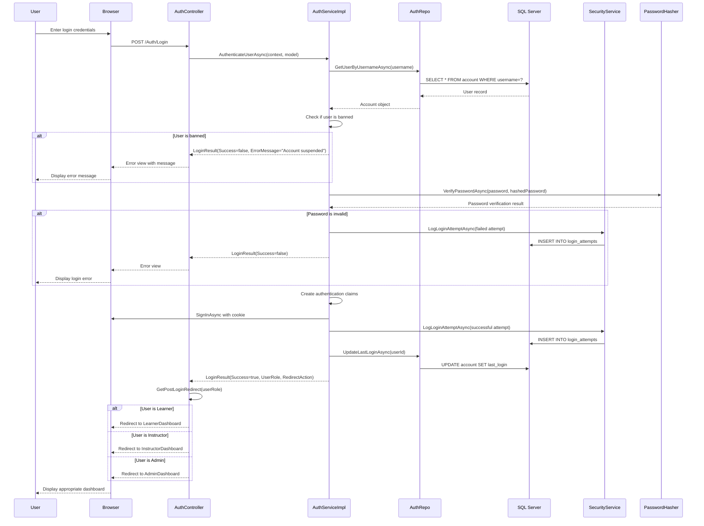
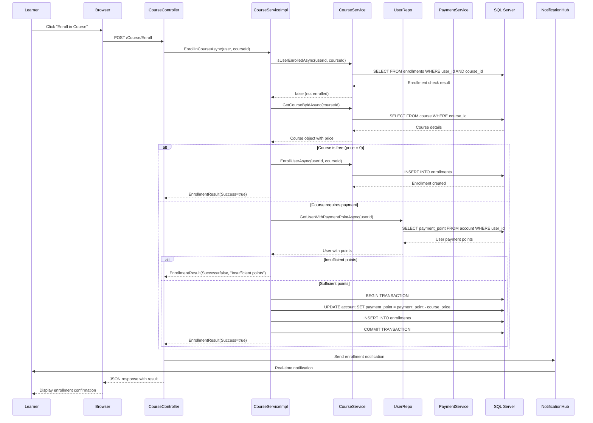
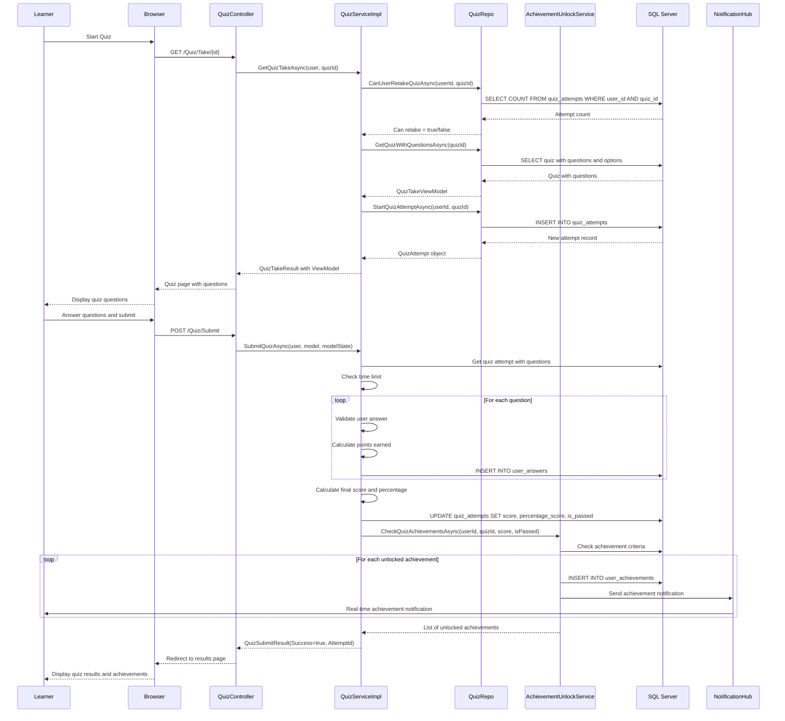
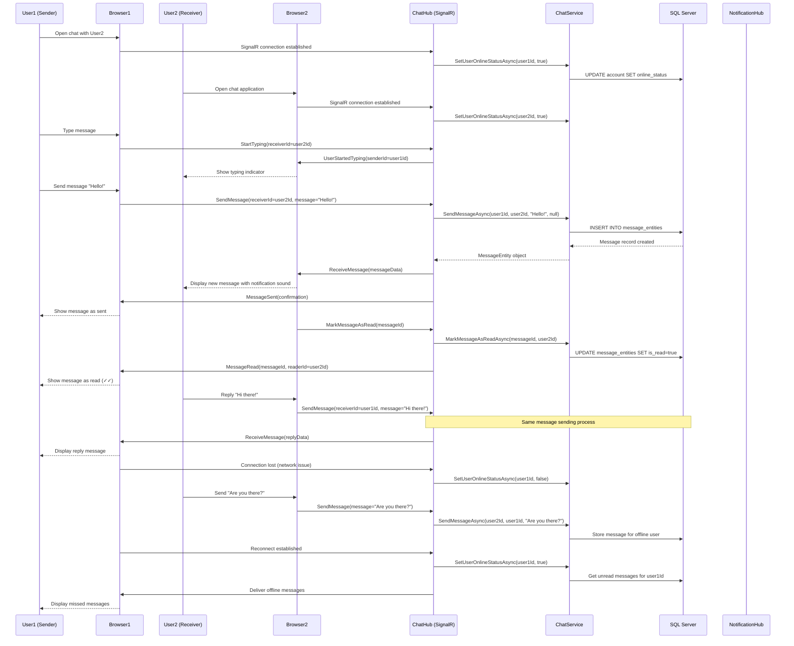
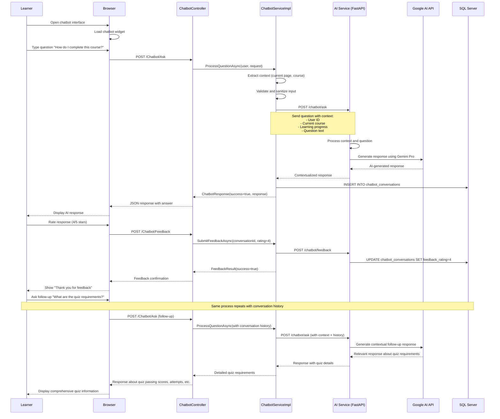
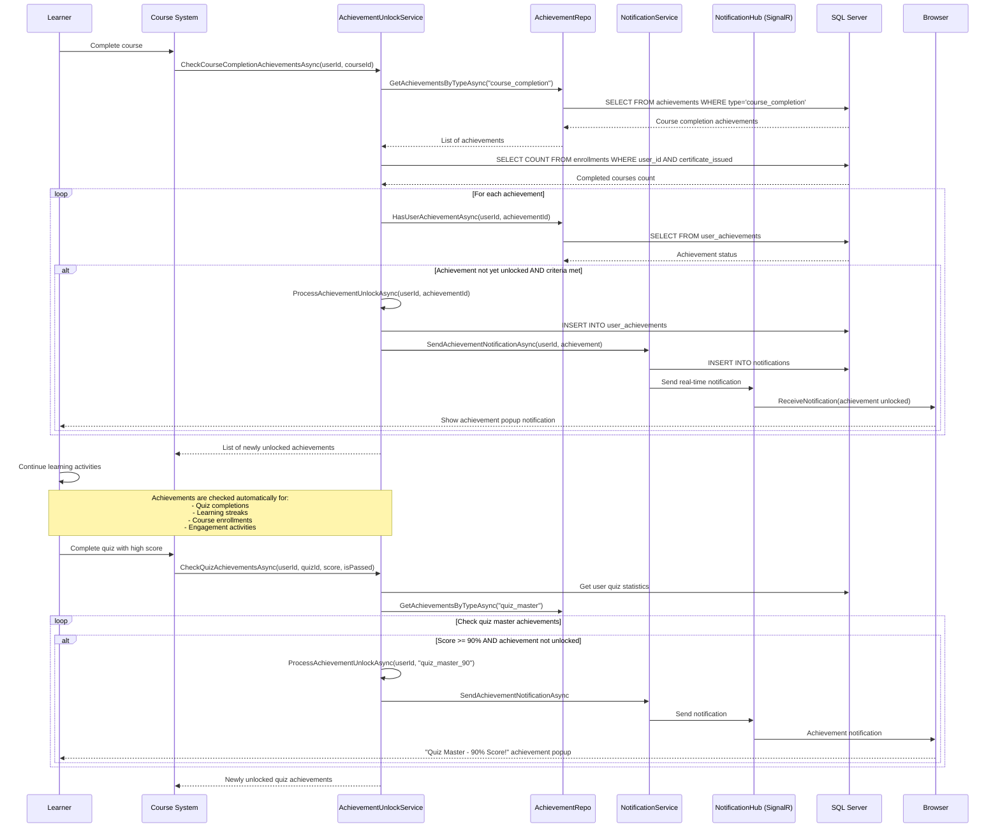

# Sequence Diagram - BrainStormEra E-Learning Platform

## Overview
This document contains multiple sequence diagrams showing detailed interactions between system components, actors, and external services in the BrainStormEra e-learning platform.

## Sequence Diagrams

### 1. User Authentication and Authorization Flow

### 2. Course Enrollment and Payment Processing Flow

### 3. Quiz Taking and Auto-Grading Flow

### 4. Real-time Chat Communication Flow

### 5. AI Chatbot Interaction Flow

### 6. Achievement Unlocking and Notification Flow

## Sequence Flow Descriptions

### Authentication Flow
1. **Credential Validation**: Multi-step verification including user existence, ban status, and password verification
2. **Security Logging**: All login attempts are logged for security monitoring
3. **Claims Creation**: Comprehensive user information stored in authentication claims
4. **Role-based Redirection**: Users directed to appropriate dashboards based on their roles

### Course Enrollment Flow
1. **Enrollment Validation**: Check for existing enrollments to prevent duplicates
2. **Payment Processing**: Point-based system with transaction management
3. **Database Transactions**: Atomic operations ensure data consistency
4. **Real-time Notifications**: Immediate feedback via SignalR

### Quiz Assessment Flow
1. **Attempt Management**: Retry limits and time restrictions enforced
2. **Auto-grading**: Immediate scoring with detailed feedback
3. **Achievement Integration**: Automatic achievement checking upon completion
4. **Progress Tracking**: Course progression updated based on quiz results

### Real-time Communication
1. **Connection Management**: User online status tracking
2. **Message Delivery**: Real-time for online users, stored for offline users
3. **Read Receipts**: Message status tracking with visual indicators
4. **Typing Indicators**: Live interaction feedback

### AI Chatbot Integration
1. **Context Awareness**: Current course and progress considered in responses
2. **External AI Service**: Integration with Google AI via FastAPI service
3. **Conversation History**: Maintained for better context in follow-up questions
4. **Feedback Loop**: User ratings improve AI response quality

### Achievement System
1. **Automatic Monitoring**: Continuous checking of achievement criteria
2. **Multi-trigger Events**: Achievements can be unlocked by various activities
3. **Real-time Notifications**: Immediate notification delivery via SignalR
4. **Comprehensive Tracking**: Detailed statistics for achievement calculation

## Technical Implementation Details

- **SignalR**: Enables real-time bidirectional communication
- **Entity Framework**: ORM for database operations with transaction support
- **JWT Authentication**: Secure, stateless authentication with claims
- **Async/Await**: Non-blocking operations for better performance
- **Repository Pattern**: Data access abstraction for maintainability
- **Service Layer**: Business logic separation and reusability 