# Use Case Diagram - BrainStormEra E-Learning Platform

## Overview
This Use Case Diagram illustrates all the major functionalities and interactions in the BrainStormEra e-learning platform, showing the relationships between different user types and system features.

## Actors
- **Guest User**: Unregistered users who can browse publicly available content
- **Learner**: Registered students who enroll in courses and learn
- **Instructor**: Course creators and educators who manage educational content
- **Admin**: System administrators who manage the entire platform
- **AI Chatbot**: Automated assistant providing 24/7 support

```mermaid
graph TB
    subgraph "BrainStormEra E-Learning Platform"
        subgraph "Authentication & User Management"
            UC1[Register Account]
            UC2[Login/Logout]
            UC3[Reset Password]
            UC4[Manage Profile]
            UC5[Change Password]
        end
        
        subgraph "Course Management"
            UC6[Browse Courses]
            UC7[Search Courses]
            UC8[View Course Details]
            UC9[Create Course]
            UC10[Edit Course]
            UC11[Delete Course]
            UC12[Approve Course]
            UC13[Manage Categories]
        end
        
        subgraph "Learning Experience"
            UC14[Enroll in Course]
            UC15[Access Lessons]
            UC16[Track Progress]
            UC17[Take Quiz]
            UC18[View Results]
            UC19[Download Certificate]
            UC20[Review Course]
        end
        
        subgraph "Content Management"
            UC21[Create Chapter]
            UC22[Create Lesson]
            UC23[Upload Materials]
            UC24[Create Quiz]
            UC25[Manage Questions]
            UC26[Grade Assessments]
        end
        
        subgraph "Communication System"
            UC27[Send Messages]
            UC28[Real-time Chat]
            UC29[View Notifications]
            UC30[Chatbot Interaction]
            UC31[Provide Feedback]
        end
        
        subgraph "Achievement System"
            UC32[Earn Achievements]
            UC33[View Achievements]
            UC34[Track Streaks]
            UC35[Manage Rewards]
        end
        
        subgraph "Payment & Enrollment"
            UC36[Process Payment]
            UC37[Manage Transactions]
            UC38[Refund Processing]
            UC39[Point Management]
        end
        
        subgraph "Administration"
            UC40[User Management]
            UC41[System Analytics]
            UC42[Security Dashboard]
            UC43[Platform Configuration]
            UC44[Content Moderation]
        end
        
        subgraph "Reporting & Analytics"
            UC45[Generate Reports]
            UC46[View Dashboard]
            UC47[Track Engagement]
            UC48[Monitor Performance]
        end
    end
    
    %% Actors
    Guest[Guest User]
    Learner[Learner]
    Instructor[Instructor]
    Admin[Admin]
    AIBot[AI Chatbot]
    
    %% Guest User interactions
    Guest --> UC1
    Guest --> UC2
    Guest --> UC3
    Guest --> UC6
    Guest --> UC7
    Guest --> UC8
    
    %% Learner interactions
    Learner --> UC2
    Learner --> UC4
    Learner --> UC5
    Learner --> UC6
    Learner --> UC7
    Learner --> UC8
    Learner --> UC14
    Learner --> UC15
    Learner --> UC16
    Learner --> UC17
    Learner --> UC18
    Learner --> UC19
    Learner --> UC20
    Learner --> UC27
    Learner --> UC28
    Learner --> UC29
    Learner --> UC30
    Learner --> UC31
    Learner --> UC32
    Learner --> UC33
    Learner --> UC34
    Learner --> UC36
    Learner --> UC37
    Learner --> UC46
    
    %% Instructor interactions
    Instructor --> UC2
    Instructor --> UC4
    Instructor --> UC5
    Instructor --> UC6
    Instructor --> UC7
    Instructor --> UC8
    Instructor --> UC9
    Instructor --> UC10
    Instructor --> UC11
    Instructor --> UC21
    Instructor --> UC22
    Instructor --> UC23
    Instructor --> UC24
    Instructor --> UC25
    Instructor --> UC26
    Instructor --> UC27
    Instructor --> UC28
    Instructor --> UC29
    Instructor --> UC30
    Instructor --> UC45
    Instructor --> UC46
    Instructor --> UC47
    Instructor --> UC48
    
    %% Admin interactions
    Admin --> UC2
    Admin --> UC4
    Admin --> UC5
    Admin --> UC12
    Admin --> UC13
    Admin --> UC35
    Admin --> UC38
    Admin --> UC39
    Admin --> UC40
    Admin --> UC41
    Admin --> UC42
    Admin --> UC43
    Admin --> UC44
    Admin --> UC45
    Admin --> UC46
    Admin --> UC47
    Admin --> UC48
    
    %% AI Chatbot interactions
    AIBot --> UC30
    AIBot --> UC31
    
    %% Use case relationships
    UC14 -.->|includes| UC36
    UC15 -.->|includes| UC16
    UC17 -.->|includes| UC18
    UC18 -.->|extends| UC32
    UC16 -.->|extends| UC19
    UC9 -.->|includes| UC21
    UC21 -.->|includes| UC22
    UC22 -.->|includes| UC24
    UC2 -.->|extends| UC4
    UC40 -.->|includes| UC41
    
    %% Styling
    classDef guestClass fill:#e1f5fe
    classDef learnerClass fill:#f3e5f5
    classDef instructorClass fill:#e8f5e8
    classDef adminClass fill:#fff3e0
    classDef botClass fill:#fce4ec
    
    class Guest guestClass
    class Learner learnerClass
    class Instructor instructorClass
    class Admin adminClass
    class AIBot botClass
```

## Use Case Descriptions

### Authentication & User Management
- **Register Account**: New users create accounts with email verification
- **Login/Logout**: Secure authentication with role-based access
- **Reset Password**: Password recovery via email OTP verification
- **Manage Profile**: Users update personal information and preferences
- **Change Password**: Secure password modification

### Course Management
- **Browse Courses**: View available courses with filtering and pagination
- **Search Courses**: Find courses using keywords, categories, and filters
- **View Course Details**: Access course information, syllabus, and reviews
- **Create Course**: Instructors design new educational content
- **Edit/Delete Course**: Modify or remove existing courses
- **Approve Course**: Admin approval process for course publication
- **Manage Categories**: Organize courses into educational categories

### Learning Experience
- **Enroll in Course**: Students join courses (free or paid)
- **Access Lessons**: Progressive learning through structured content
- **Track Progress**: Monitor learning advancement and completion
- **Take Quiz**: Complete assessments to test knowledge
- **View Results**: Review quiz scores and detailed feedback
- **Download Certificate**: Generate completion certificates
- **Review Course**: Provide ratings and feedback

### Communication System
- **Send Messages**: Direct messaging between users
- **Real-time Chat**: Live conversation using SignalR
- **View Notifications**: System and course-related alerts
- **Chatbot Interaction**: AI-powered learning assistance
- **Provide Feedback**: Rate conversations and content

### Achievement System
- **Earn Achievements**: Unlock badges through learning milestones
- **View Achievements**: Display earned accomplishments
- **Track Streaks**: Monitor learning consistency
- **Manage Rewards**: Admin configuration of achievement system

### Administration
- **User Management**: Control user accounts and permissions
- **System Analytics**: Monitor platform performance and usage
- **Security Dashboard**: Oversee security threats and measures
- **Platform Configuration**: System-wide settings management
- **Content Moderation**: Review and approve user-generated content

## Business Rules

1. **Enrollment**: Users must be authenticated to enroll in courses
2. **Payment**: Course enrollment may require payment verification
3. **Progress**: Sequential lesson completion may be enforced
4. **Certification**: Certificates issued only upon course completion
5. **Content Creation**: Only instructors and admins can create courses
6. **Moderation**: All course content requires approval before publication
7. **Achievement**: Automatic unlocking based on predefined criteria
8. **Communication**: Real-time features require active connection

## System Boundaries

The system encompasses:
- Web-based learning platform (ASP.NET Core MVC)
- Real-time communication (SignalR)
- AI-powered chatbot service (FastAPI)
- Payment processing integration
- Certificate generation system
- Achievement and gamification engine 